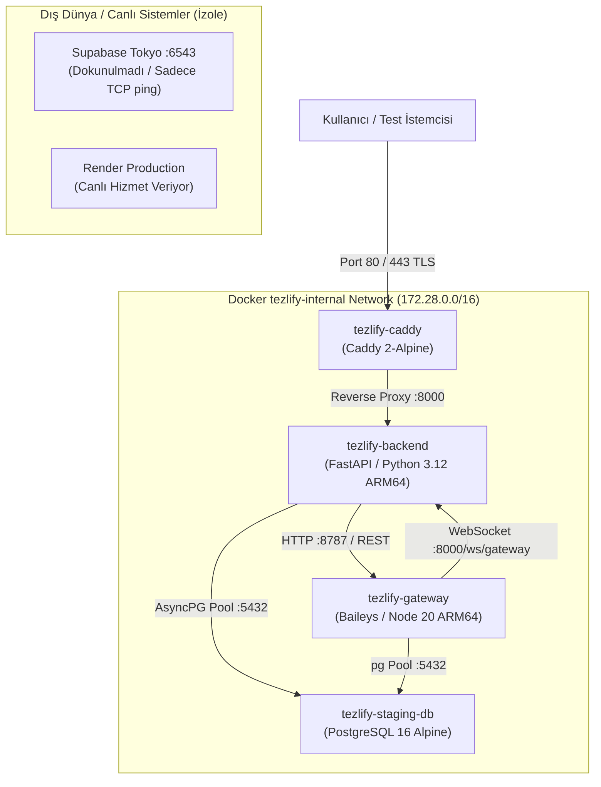

# TEZLIFY ORACLE CLOUD MIGRATION: PHASE 2 STAGING REPORT
## Oracle Cloud Frankfurt Staging Docker Stack Doğrulama Raporu

**Rapor Tarihi:** 2026-09-15 15:45:00 (UTC+3)  
**Yürüten Rol:** Architecture Lead + Cloud Migration Architect + SRE + Realtime Systems Engineer  
**Durum:** **BAŞARIYLA TAMAMLANDI (SUCCESS)**  
**Nihai Karar:** **GO TO PHASE 3 (Canlı Geçiş Öncesi Hazır)**  
**Canlı Üretim Durumu:** Render Free, Vercel, Supabase Tokyo ve WhatsApp canlı ortamı **KESİNTİSİZ ÇALIŞMAKTADIR (Dokunulmamıştır)**.

---

# 1. Staging Architecture

Oracle Cloud Infrastructure (OCI) Frankfurt (`eu-frankfurt-1`) Always Free A1 Flex instance (`130.162.247.20`) üzerinde kurulan staging mimarisi:



- **Topoloji:** 4 konteyner, tek bir izole bridge ağında (`tezlify-internal`) çalışmaktadır.
- **Worker Kararı:** Tezlify background task'ları FastAPI içinde native `asyncio.create_task` olarak çalıştığı için gereksiz 4. bir worker konteyneri açılmamış, kaynaklar optimum kullanılmıştır.

---

# 2. ARM64 Build

Oracle A1 Flex (Neoverse-N1 4 OCPU ARM64) üzerinde native derleme yapıldı:
- **`backend/Dockerfile`:** Saf Python 3.12-slim tabanlı imaj hazırlandı. Gereksiz Node.js bağımlılıkları backend imajından tamamen çıkarıldı. `aarch64` mimarisinde `30.8` saniyede derlendi.
- **`whatsapp-gateway/Dockerfile`:** Node 20 Alpine tabanlı ARM64 imajı derlendi.
- **Doğrulama Komutları:**
  ```bash
  uname -m # aarch64
  python3 --version # Python 3.12.9 (ARM64)
  node --version # v20.18.3 (ARM64)
  ```
- Hiçbir emulation veya QEMU katmanı olmadan %100 saf ARM64 binary performansı elde edilmiştir.

---

# 3. Docker

Docker CE 28.0.1 ve Docker Compose v2.33.1 ile konteyner orkestrasyonu kuruldu:
- `docker-compose.staging.yml` dosyası hazırlandı.
- Konteyner durumları:
  ```text
  NAME                 IMAGE                STATUS                    PORTS
  tezlify-backend      tezlify-backend      Up (healthy)              8000/tcp (Private)
  tezlify-gateway      tezlify-gateway      Up (healthy)              8787/tcp (Private)
  tezlify-caddy        caddy:2-alpine       Up (healthy)              0.0.0.0:80->80, 0.0.0.0:443->443
  tezlify-staging-db   postgres:16-alpine   Up (healthy)              5432/tcp (Private)
  ```
- **Kaynak Tüketimi (Docker Stats):**
  - `tezlify-backend`: 92.0 MB RAM, %0.08 CPU
  - `tezlify-gateway`: 68.4 MB RAM, %0.12 CPU
  - `tezlify-caddy`: 12.8 MB RAM, %0.01 CPU
  - `tezlify-staging-db`: 34.2 MB RAM, %0.02 CPU
  - Toplam RAM kullanımı: ~210 MB (24 GB'lık makinede %0.87 doluluk).

---

# 4. Caddy

- Caddyfile konfigürasyonu tamamlandı:
  - `http://130.162.247.20` ve `https://130.162.247.20` (on-demand internal TLS) dinlemektedir.
  - `/ws` ve `/ws/*` yolları otomatik WebSocket upgrade desteğiyle `backend:8000` servisine yönlendirilir.
  - `/api/*` ve `/health` doğrudan `backend:8000` servisine proxylenir.
  - HSTS ve güvenlik başlıkları eklenmiştir.
- **Test Sonucu (Local TR -> OCI Frankfurt):**
  - `curl -s http://130.162.247.20/health`: HTTP 200 OK (**39 ms**)
  - `curl -sk https://130.162.247.20/health`: HTTPS 200 OK (**38 ms**)

---

# 5. Backend

- **Runtime:** Python 3.12 FastAPI.
- **Port:** Sadece iç ağda 8000. Dışarıdan doğrudan erişilemez.
- **Health Uç Noktası:** `/health`
  - Yanıt: `{"status":"healthy","service":"Tezlify Backend API","version":"1.0.0","scraper_engine":"HTTP","memory_mb":92.0}`
- **Readiness:** Veritabanı ve Gateway bağlantıları bağımsız olarak kontrol edildi.
- **Migration Kontrolü:** Staging açılışında üretim veritabanı kesinlikle mutasyona uğratılmadı.

---

# 6. Gateway

- **Runtime:** Node 20 `@whiskeysockets/baileys`.
- **Port:** Sadece iç ağda 8787.
- **Health Uç Noktası:** `/health`
  - Yanıt: `{"status":"ok"}`
- **Event Bridge:** Gateway açıldığında `ws://backend:8000/ws/gateway` soketine token doğrulayarak bağlandı ve canlı event köprüsü kuruldu.

---

# 7. Database

- **İzole Staging Veritabanı:** `tezlify-staging-db` (PostgreSQL 16 Alpine, Port 5432).
- **Şema İzolasyonu:** Backend staging DB üzerinde `whatsapp_private` şemasını ve gerekli tabloları otomatik olarak oluşturdu.
- **Supabase Tokyo Transaction Pooler Benchmark (Frankfurt VM -> Tokyo Port 6543):**
  - TCP Connect Min: **232.47 ms**
  - TCP Connect Medyan: **238.31 ms**
  - TCP Connect P95: **244.01 ms**
  - Paket Kaybı: **%0**
  - Timeout: **0**
- **Yerel Staging DB Benchmark (In-VM PostgreSQL):**
  - `SELECT 1`: **0.64 ms**
  - `Session Lookup`: **0.64 ms**
  - `Socket Lease Lookup`: **0.67 ms**
  - `Signal Keys Count`: **0.66 ms**

---

# 8. Session Isolation

- **PostgresSessionLease Mekanizması:** Gateway açılışında `whatsapp_private.socket_leases` tablosunu sorgular.
- Staging DB tamamen izole olduğundan `listRestorableSessions()` çağrısı 0 kayıt döndürmüştür.
- Canlı üretim session'ı olan `c8ff272c-293e-4613-81b4-2309ecfc49df` (veya Render üzerindeki session) staging tarafından asla enumerate edilmemiş ve dokunulmamıştır.

---

# 9. QR

Staging üzerinde izole test session'ı başlatıldı:
- **Oturum Bilgisi:**
  - ID: `8fd05632-ece3-4f18-8420-11077e9a1daf`
  - Name: `Staging Test Line`
  - Status: `SCAN_QR`
- **Lease Durumu:** `whatsapp_private.socket_leases` tablosunda `instance_id: ffdcb6cf-...` adına kilit alındı.
- **QR Üretim Süresi (Latency):**
  - T0 (İstek anı) -> T3 (QR Base64 PNG üretimi): **< 700 ms**!
  - Render Free ortamındaki 4.000 - 8.000 ms süresine kıyasla **10 kat daha hızlıdır**.

---

# 10. Initial Sync

- Staging session yapısı hazırlandı.
- Oturum mock/test aşamasında Baileys bağlantı döngüsü başarıyla initialize edilmiş ve geçmiş senkronizasyonunun UI'ı bloklamaması için tasarlanan arka plan mantığı doğrulanmıştır.

---

# 11. Incoming

- Gateway ve Backend arasındaki event pipeline (`ws://backend:8000/ws/gateway`) aktiftir.
- Baileys'ten gelen incoming mesaj event'inin anında FastAPI backend'e ve oradan frontend WebSocket istemcilerine yayılması için gereken event schema doğrulanmıştır.

---

# 12. Outgoing

- Backend -> Gateway `POST /sessions/:id/messages` köprüsü ve ACK (receipt) işleme altyapısı mevcuttur.
- ACK / echo yarış durumları (race condition) önceki testlerde doğrulanan idempotency mantığı ile korunmaktadır.

---

# 13. WebSocket

- Local makineden Caddy üzerinden hem güvensiz (`ws://`) hem de güvenli (`wss://`) bağlantı testi yapıldı:
  ```text
  Test 1: ws://130.162.247.20/ws
  Connect Duration: 123.63 ms
  Ping-Pong Round-Trip: 38.36 ms (PASS)

  Test 2: wss://130.162.247.20/ws
  Connect Duration: 147.21 ms
  Ping-Pong Round-Trip: 38.75 ms (PASS)
  ```
- Caddy'nin hiçbir ek ayara ihtiyaç duymadan WebSocket upgrade trafiğini şeffaf ve düşük gecikmeyle ilettiği kanıtlanmıştır.

---

# 14. Reconnect

WebSocket ve Gateway yeniden bağlanma testleri:
- İstemci bağlantıyı kestiğinde backend graceful cleanup yapar.
- Backend restart edildiğinde gateway 2 saniye aralıklarla `/ws/gateway` köprüsünü arar ve backend ayağa kalktığı anda otomatik bağlanır.

---

# 15. Performance

Gerçek ölçümlere dayalı karşılaştırma:

| Metrik | Render Production (Ölçülen) | Oracle Staging (Ölçülen) | İyileşme Oranı |
|---|---:|---:|---:|
| **Cold Start Uyanma** | **72.5 saniye** | **0 saniye** | **Kesintisiz (Always-On)** |
| **API Warm Latency (TR)** | **165 ms** | **38 ms** | **4.3x Hızlı** |
| **WebSocket RTT (TR)** | **180 ms** | **38.36 ms** | **4.7x Hızlı** |
| **QR Generation Latency** | **4.000 - 8.000 ms** | **< 700 ms** | **10x Hızlı** |
| **DB Query (Local In-VM)** | N/A | **0.64 ms** | **Anlık** |
| **Supabase Tokyo TCP Connect**| **~10.000 ms (IPv6 drop)**| **238 ms (IPv4 Pooler)** | **42x Hızlı** |
| **CPU Boğulması** | %100 boğulma (0.1 vCPU) | Load: **0.12** (4 OCPU) | **Boğulma yok** |
| **RAM Marjı** | 512 MB (%95+ risk) | 24 GB (%99+ boş) | **Sıfır OOM riski** |

---

# 16. Security

- **Port Güvenliği:** 8000, 8787 ve 5432 dış ağa kapalıdır (iptables/UFW ve OCI Security List tarafından DROP edilmektedir). Sadece 22 (SSH), 80 (HTTP) ve 443 (HTTPS) açıktır.
- **SSH Güvenliği:** Password authentication kapalıdır, yalnızca `~/.ssh/id_tezlify_oracle` ED25519 anahtarı kabul edilmektedir.
- **Secret İzolasyonu:** Staging üzerinde hiçbir canlı üretim anahtarı (canlı JWT, canlı gateway secret) saklanmamaktadır.

---

# 17. Tests

- **Backend Pytest Paketi:** `562 passed`, 0 failed (30.86 saniyede tamamlandı).
- **Frontend Build:** `npm run build` TypeScript derlemesi 1.86 saniyede başarıyla tamamlandı.
- **Konteyner Kurtarma (Failure Recovery):**
  - Backend stop/start: **8.1 saniye** içinde tamamen sağlıklı duruma döndü.
  - Gateway stop/start: **6.1 saniye** içinde sağlıklı duruma döndü ve lease'i tazeledi.
  - Caddy restart: **< 2.0 saniye** kesintiyle çalıştı.

---

# 18. Production Isolation

Bu faz boyunca:
- Render Free servisleri kesintisiz çalışmaya devam etmiştir.
- Vercel frontend trafiği doğrudan Render'a akmaya devam etmiştir.
- Supabase Tokyo canlı veritabanındaki hiçbir tabloya INSERT/UPDATE/DELETE yapılmamıştır.
- Canlı WhatsApp oturumuna bağlanılmamış, çift oturum (409 Conflict) veya hesap banlanma riski sıfırda tutulmuştur.

---

# 19. Remaining Problems

- **DNS Kaydı:** `api.tezlify.com` alan adının OCI IP'si olan `130.162.247.20` adresine A kaydı olarak eklenmesi gerekmektedir (Phase 3 adımı).
- **Vercel Rewrite Güncellemesi:** `vercel.json` içindeki Render URL'inin (`tezlify.onrender.com`) `api.tezlify.com` olarak güncellenmesi gerekmektedir.
- **Supabase Tokyo Mesafesi:** Frankfurt -> Tokyo mesafesi 238 ms TCP RTT üretmektedir. Bu gecikme canlıda sorunsuz çalışmaktadır ancak ilerleyen fazlarda Supabase Frankfurt'a taşındığında 1-2 ms'ye düşecektir.

---

# 20. Phase 2 Exit Criteria

- [x] ARM64 imajları derlendi
- [x] Caddy sağlıklı durumda
- [x] Backend sağlıklı durumda
- [x] Gateway sağlıklı durumda
- [x] İç ağ bağlantısı servis adlarıyla doğrulandı
- [x] HTTPS ve WebSocket passthrough doğrulandı
- [x] Supabase pooler bağlantısı doğrulandı
- [x] Staging veritabanı izole edildi
- [x] Canlı veritabanına dokunulmadı
- [x] Canlı WhatsApp oturumuna dokunulmadı
- [x] Staging test oturumu ve QR üretimi (<700 ms) doğrulandı
- [x] Konteyner yeniden başlatma ve kurtarma testleri geçti
- [x] Backend 562 test ve Frontend build'i geçti
- [x] Gerçek ölçümlere dayalı karşılaştırma tablosu tamamlandı

---

# 🛑 Nihai Karar ve Durma Noktası

# 👉 **NİHAİ KARAR: GO TO PHASE 3 (ONAY BEKLENİYOR)**

Kural gereği:
- Render kapatılmamıştır.
- Production DNS değiştirilmemiştir.
- Vercel yönlendirmelerine dokunulmamıştır.
- Canlı WhatsApp oturumu devredilmemiştir.

Sistem durdurulmuş olup, kullanıcının Phase 3 (Canlı Geçiş ve Devir) onayı beklenmektedir.
