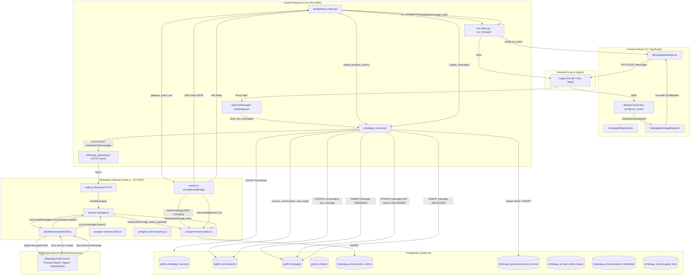

# Phase 11.5 — WhatsApp Architecture Map

**Document Status**: COMPLETE & VERIFIED  
**Phase**: 11.5 — WhatsApp Architecture Preparation & Characterization  
**Scope**: Full end-to-end runtime architecture, data flow, transport topology, and boundary ownership.

---

## 1. Executive Summary

Tezlify implements a three-tier decoupled WhatsApp integration designed for carrier-grade multi-tenant B2B outreach and real-time chat operations:
1. **Tier 1: Frontend (`frontend/src/features/whatsapp/` & `WhatsAppHubPage.tsx`)**:
   - Single-page reactive communication hub (React 18 + TypeScript + Vite + Tailwind CSS).
   - Consumes REST endpoints via [whatsappApi.ts](file:///Users/isatezcan/Documents/Github/Tezlify/frontend/src/features/whatsapp/api/whatsappApi.ts) and [whatsappRepository.ts](file:///Users/isatezcan/Documents/Github/Tezlify/frontend/src/features/whatsapp/data/whatsappRepository.ts).
   - Receives server-pushed real-time events over `/ws` using the centralized WebSocket bus (`tezlify:ws_event`).
   - Uses identity-based deterministic message reconciliation ([whatsappMessageMerge.ts](file:///Users/isatezcan/Documents/Github/Tezlify/frontend/src/features/whatsapp/lib/whatsappMessageMerge.ts)) without relying on text content.

2. **Tier 2: Backend Core (`backend/app/services/whatsapp_service.py` & `whatsapp.py` router)**:
   - FastAPI REST endpoints in [whatsapp.py](file:///Users/isatezcan/Documents/Github/Tezlify/backend/app/api/v1/endpoints/whatsapp.py).
   - Monolithic domain coordinator in [whatsapp_service.py](file:///Users/isatezcan/Documents/Github/Tezlify/backend/app/services/whatsapp_service.py) (93 functions, 3,982 lines) managing persistence, transaction boundaries, identity translation (JID ↔ numeric conversation IDs), and multi-tenant isolation.
   - Dedicated inbound gateway WebSocket ingestion endpoint `/ws/gateway` in [main.py](file:///Users/isatezcan/Documents/Github/Tezlify/backend/app/main.py#L219-L320) with fail-closed token validation via `WHATSAPP_GATEWAY_SECRET`.
   - Dual-event delivery guarantee: processed event deduplication via `whatsapp_private.processed_events` and WebSocket client broadcasting via `ws_manager`.

3. **Tier 3: Node.js Gateway (`whatsapp-gateway/`)**:
   - Independent Node.js microservice leveraging `@whiskeysockets/baileys` (v6.7+).
   - Core session coordinator in [session-manager.js](file:///Users/isatezcan/Documents/Github/Tezlify/whatsapp-gateway/src/session-manager.js) (3,032 lines).
   - Durable PostgreSQL-backed event outbox in [postgres-event-outbox.js](file:///Users/isatezcan/Documents/Github/Tezlify/whatsapp-gateway/src/outbox/postgres-event-outbox.js) (`whatsapp_private.event_outbox`) with `FOR UPDATE SKIP LOCKED` batching.
   - High-availability socket distributed locking in [postgres-session-lease.js](file:///Users/isatezcan/Documents/Github/Tezlify/whatsapp-gateway/src/lease/postgres-session-lease.js) (`whatsapp_private.socket_leases`).
   - Signal protocol keys and credentials encrypted at rest with AES-256-GCM in [postgres-auth-repository.js](file:///Users/isatezcan/Documents/Github/Tezlify/whatsapp-gateway/src/auth/postgres-auth-repository.js) (`whatsapp_private.session_credentials`, `whatsapp_private.signal_keys`).

---

## 2. Global Architecture Diagram



---

## 3. End-to-End Inbound Message Pipeline

```text
[WhatsApp Meta Network]
        │
        │ NoiseSocket frame
        ▼
[Baileys (GW)]
        │ ev.on('messages.upsert')
        ▼
[session-manager.js]
        │ _onMessageUpsert() / sanitizeChatForEmit()
        ▼
[postgres-event-outbox.js]
        │ enqueue() -> AES-256-GCM encrypt
        │ INSERT INTO whatsapp_private.event_outbox (state='PENDING')
        ▼
[events.js (Outbox Pump)]
        │ claimPending() -> SELECT FOR UPDATE SKIP LOCKED
        │ UPDATE state='IN_FLIGHT', attempts=attempts+1
        │ WSS send to Backend (/ws/gateway?token=WHATSAPP_GATEWAY_SECRET)
        ▼
[backend/app/main.py: gateway_websocket_endpoint]
        │ raw JSON parse -> ingest_gateway_event()
        ▼
[backend/app/services/whatsapp_service.py]
        │ 1. Dedup check: SELECT 1 FROM whatsapp_private.processed_events WHERE event_id = :id
        │ 2. _ingest_message():
        │    - Resolve user_id from session gateway_id
        │    - In-memory lock: async with _get_conversation_lock(user_id, jid)
        │    - _ensure_conversation_race_safe(db, user_id, jid)
        │    - INSERT INTO messages (direction='INBOUND', status='RECEIVED')
        │    - UPDATE conversations (last_message_at, last_message_preview, unread_count + 1)
        │ 3. INSERT INTO whatsapp_private.processed_events (event_id)
        │ 4. db.commit()
        ▼
[backend/app/main.py]
        │ 1. websocket.send_json({"type": "gateway_event_ack", "event_id": id})
        │ 2. ws_manager.broadcast(persisted_event)
        ▼
[postgres-event-outbox.js]
        │ acknowledge(event_id) -> UPDATE state='DELIVERED', delivered_at=NOW()
        ▼
[Frontend: useWebSocket / window EventListener]
        │ 'tezlify:ws_event' (event === 'message_new')
        ▼
[WhatsAppHubPage.tsx]
        │ mergeWhatsAppMessages(prev, incoming)
        │ Auto-read trigger if conversation is actively focused
        │ Audio chirp notification
        ▼
[ChatThread.tsx & ChatBubble.tsx]
        │ Incremental virtual render
```

---

## 4. End-to-End Outbound Message Pipeline

```text
[User clicks 'Send' in ChatComposer.tsx]
        │
        ▼
[WhatsAppHubPage.tsx]
        │ Optimistic UI: adds message with client_message_id, status='PENDING'
        ▼
[whatsappRepository.ts -> whatsappApi.ts]
        │ POST /api/v1/whatsapp/messages
        │ Body: { conversation_id, message, client_message_id, message_type }
        ▼
[backend/app/api/v1/endpoints/whatsapp.py: send_message]
        │ Validates request, checks active session
        │ Calls whatsapp_service.send_text_message()
        ▼
[backend/app/services/whatsapp_service.py: send_text_message]
        │ 1. Lock: async with _get_conversation_lock(user_id, jid)
        │ 2. Fetch or create Message row in DB (status='PENDING', client_message_id)
        │ 3. db.commit()
        │ 4. Call gateway: whatsapp_gateway.send_message(session_id, phone, text)
        ▼
[backend/app/services/whatsapp_gateway.py: send_message]
        │ HTTP POST http://tezlify-gateway:8787/sessions/{id}/messages
        │ Headers: { X-Gateway-Secret }
        ▼
[whatsapp-gateway/src/index.js -> session-manager.js: sendMessage]
        │ 1. Acquire socket lease (postgres-session-lease)
        │ 2. sock.sendMessage(jid, { text })
        │ 3. Return { success: true, messageId: wa_message_id, timestamp }
        ▼
[whatsapp_service.py]
        │ Update Message row: wa_message_id = response.messageId, status='SENT'
        │ Update Conversation: last_message_at = NOW(), last_message_preview = text
        │ db.commit()
        │ Return response DTO
        ▼
[Frontend API Client receives HTTP 200]
        │ Reconciles optimistic message with server row: ID and wa_message_id bound
        ▼
[Subsequent Delivery & Read ACKs from Meta Network]
        │ Inbound ACK via Baileys -> Gateway Outbox -> /ws/gateway -> DB status='DELIVERED'/'READ'
        │ Broadcast over /ws -> Frontend mergeDeliveryStatus() -> Blue checks in UI
```

---

## 5. Storage & Persistence Schema Boundary

| Table | Database Schema | Primary Owner | Mutator(s) | Read Access | Invariant / Critical Constraint |
|---|---|---|---|---|---|
| `whatsapp_sessions` | `public` | Backend | `whatsapp_service.py` | Backend, Frontend (via API) | One active session per tenant; status: `DISCONNECTED`, `SCAN_QR`, `CONNECTED`, `RELINK_REQUIRED`. |
| `conversations` | `public` | Backend | `whatsapp_service.py` | Backend, Frontend (via API) | Deterministic uniqueness on `(user_id, jid)`. Unread counter must be non-negative. |
| `messages` | `public` | Backend | `whatsapp_service.py` | Backend, Frontend (via API) | Uniqueness on `(conversation_id, wa_message_id)` where non-null. Direction: `INBOUND` / `OUTBOUND`. Status: `PENDING`, `SENT`, `DELIVERED`, `READ`, `RECEIVED`, `FAILED`. |
| `contacts` | `public` | Backend | `whatsapp_service.py` | Backend, Frontend (via API) | Identity resolution: JID (`@s.whatsapp.net`), LID (`@lid`), `phone_e164`. Name precedence: AddressBook > GroupSubject > PushName. |
| `event_outbox` | `whatsapp_private` | Gateway | `postgres-event-outbox.js` | Gateway Outbox Pump | Encrypted at rest (AES-256-GCM). `FOR UPDATE SKIP LOCKED`. Monotonic sequence ID. |
| `processed_events` | `whatsapp_private` | Backend | `whatsapp_service.py` | Backend Ingestion | Primary key `event_id` (UUID). Pruned after 7 days. Prevents duplicate ingestion. |
| `socket_leases` | `whatsapp_private` | Gateway | `postgres-session-lease.js` | Gateway Session Manager | Distributed lock per session ID. Prevents split-brain multi-gateway socket binding. TTL: 45s. |
| `session_credentials` | `whatsapp_private` | Gateway | `postgres-auth-repository.js` | Gateway Auth Repository | Encrypted at rest (AES-256-GCM). Context-bound key derivation. |
| `signal_keys` | `whatsapp_private` | Gateway | `postgres-auth-repository.js` | Gateway Auth Repository | Encrypted at rest (AES-256-GCM). Blind indexed query hashes. |

---

## 6. Network Security & Boundary Enforcement

1. **Gateway Isolation**:
   - The Node.js gateway is isolated within the Docker container network (`tezlify-network`), exposing port `8787` only internally.
   - External traffic cannot reach the gateway directly; all external interactions pass through FastAPI or Caddy.

2. **Backend Gateway Bridge Authentication**:
   - The `/ws/gateway` WebSocket endpoint validates the query parameter `?token=` against `settings.WHATSAPP_GATEWAY_SECRET`.
   - If invalid or missing, connection is terminated immediately with WebSocket code `1008` (Policy Violation) — **Fail Closed**.

3. **Data at Rest Cryptography**:
   - `session_credentials`, `signal_keys`, and `event_outbox` are stored in PostgreSQL schema `whatsapp_private`.
   - AES-256-GCM encryption is enforced using `GATEWAY_ENCRYPTION_KEY`.
   - Nonces and authentication tags are verified before JSON deserialization; corrupted payloads raise decryption errors immediately.
