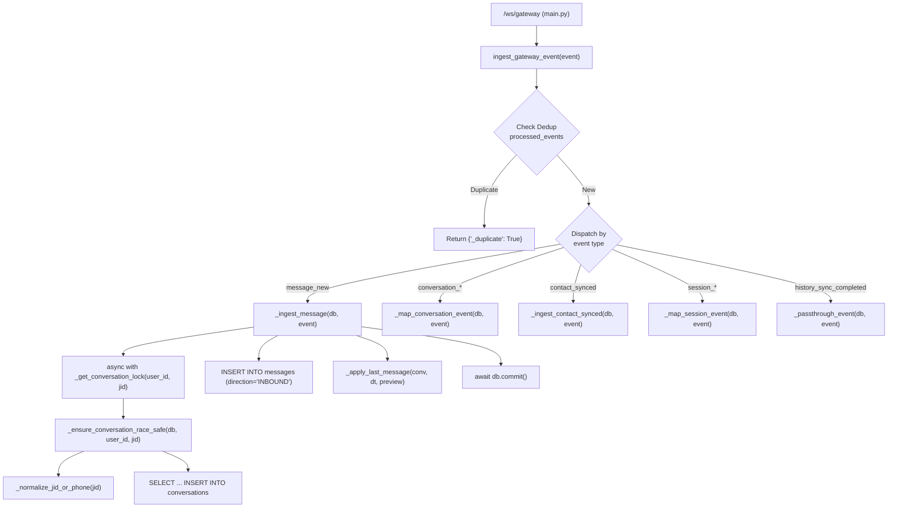
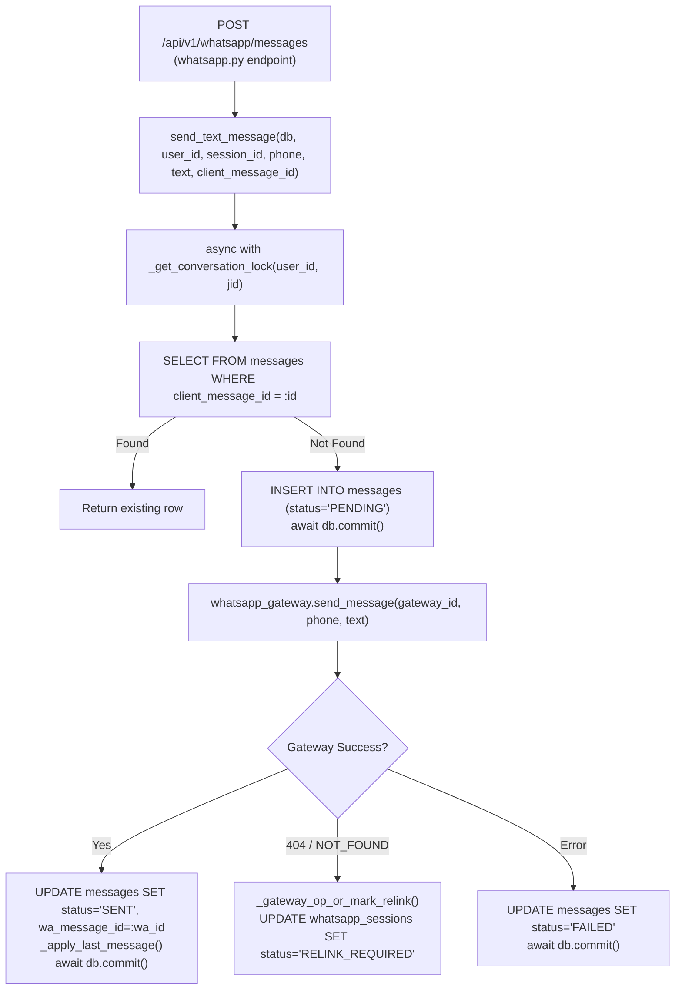
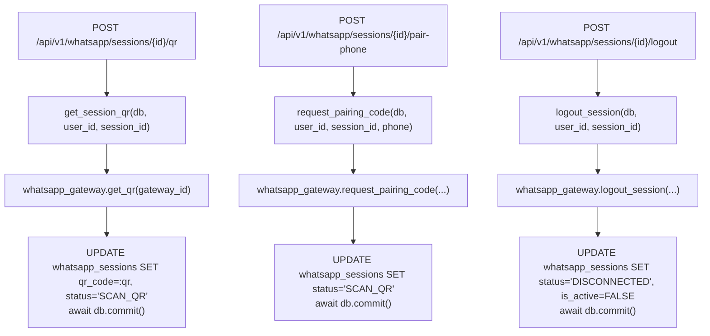
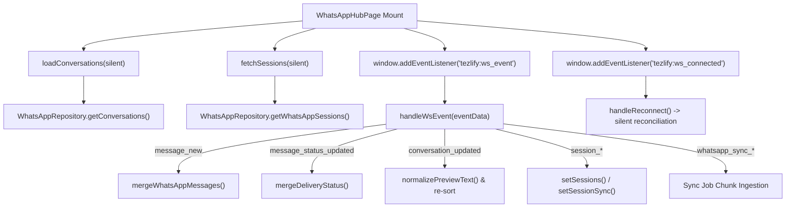

# Phase 11.5 — WhatsApp Call Graph & Dependency Analysis

**Document Status**: COMPLETE & VERIFIED  
**Phase**: 11.5 — WhatsApp Architecture Preparation & Characterization  
**Scope**: Static call graph, caller/callee traces, DB & network access, event publications, and locking dependencies across Backend, Gateway, and Frontend.

---

## 1. Backend Core Call Graph (`whatsapp_service.py`)

`whatsapp_service.py` is structured as a procedural domain service module containing 93 functions, 4 exception/data classes, and 24 module-level globals/caches.

### 1.1 Inbound Message Ingestion & Processing



#### Detailed Call Attributes:
| Function | Caller(s) | Key Callee(s) | DB Access | Network Access | Event Emission | Locking | Tx Scope |
|---|---|---|---|---|---|---|---|
| `ingest_gateway_event` | `main.py` (`/ws/gateway`) | `_ingest_message`, `_map_conversation_event`, `_ingest_contact_synced`, `_map_session_event` | `whatsapp_private.processed_events` | None | Emits via return to `main.py` | None | Owns transaction (`AsyncSessionLocal`) |
| `_ingest_message` | `ingest_gateway_event` | `_get_conversation_lock`, `_ensure_conversation_race_safe`, `_apply_last_message` | `messages`, `conversations` | None | Prepares `message_new` payload | In-memory conversation lock | Inherits db session; commits |
| `_ensure_conversation_race_safe` | `_ingest_message`, `send_text_message`, `_sync_conversations_impl` | `_normalize_jid_or_phone` | `conversations` | None | None | None | Inherited; handles `IntegrityError` with rollback & refetch |
| `_map_conversation_event` | `ingest_gateway_event` | `_apply_last_message`, `_extract_conversation_id` | `conversations`, `messages` | None | Returns mapped conversation event | None | Inherited; commits |
| `_ingest_contact_synced` | `ingest_gateway_event` | `_upsert_contact`, `_reapply_chat_names` | `contacts`, `conversations` | None | Returns mapped contact event | None | Inherited; commits |
| `_map_session_event` | `ingest_gateway_event` | `_update_session_status`, `_schedule_initial_sync` | `whatsapp_sessions` | None | Returns mapped session event | None | Inherited; commits |

---

### 1.2 Outbound Message Dispatch



#### Detailed Call Attributes:
| Function | Caller(s) | Key Callee(s) | DB Access | Network Access | Event Emission | Locking | Tx Scope |
|---|---|---|---|---|---|---|---|
| `send_text_message` | `whatsapp.py:send_message` | `_get_conversation_lock`, `_ensure_conversation_race_safe`, `whatsapp_gateway.send_message`, `_apply_last_message` | `messages`, `conversations`, `whatsapp_sessions` | HTTP to Gateway (Port 8787) | None (Relies on gateway events) | In-memory conversation lock | Inherited db; multiple commits for optimistic state |
| `send_media_message` | `whatsapp.py:send_media` | `_get_conversation_lock`, `_ensure_conversation_race_safe`, `whatsapp_gateway.send_media` | `messages`, `conversations` | HTTP to Gateway (Port 8787) | None | In-memory conversation lock | Inherited db; commits |
| `mark_conversation_read` | `whatsapp.py:mark_as_read` | `whatsapp_gateway.mark_read` | `conversations`, `messages` | HTTP to Gateway | None | None | Inherited db; commits |
| `_gateway_op_or_mark_relink` | `send_text_message`, `send_media_message`, `sync_contacts`, `_hydrate_messages_on_demand` | None | `whatsapp_sessions` | None | None | None | Inherited db; commits `RELINK_REQUIRED` on 404 |

---

### 1.3 Session Lifecycle, QR & Pairing



---

## 2. Gateway Core Call Graph (`session-manager.js`)

The Node.js Gateway handles protocol interactions with `@whiskeysockets/baileys` and outbox message publishing.

### 2.1 Baileys Event Handlers & Event Bridge

```mermaid
flowchart TD
    Baileys["@whiskeysockets/baileys Socket"] -->|ev.on('connection.update')| HandleConn["_handleConnectionUpdate(update)"]
    Baileys -->|ev.on('creds.update')| HandleCreds["authRepository.saveCredentials()"]
    Baileys -->|ev.on('messages.upsert')| HandleUpsert["_handleMessageUpsert(upsert)"]
    Baileys -->|ev.on('messages.update')| HandleMsgUpdate["_handleMessageUpdate(updates)"]
    Baileys -->|ev.on('contacts.upsert')| HandleContacts["_handleContactsUpsert(contacts)"]
    Baileys -->|ev.on('messaging-history.set')| HandleHistory["_handleMessagingHistorySet(set)"]

    HandleUpsert --> FormatRecord["_recordInboundMessage() / _recordOutboundMessage()"]
    FormatRecord --> Sanitize["sanitizeOutboundEvent()"]
    Sanitize --> EmitBridge["sessionManager._emit(event)"]

    EmitBridge --> CheckOutbox{"Has Event Outbox?"}
    CheckOutbox -->|Yes| Enqueue["postgresEventOutbox.enqueue(event)\n(AES-256-GCM encrypted)"]
    CheckOutbox -->|No| FallbackBuf["fallbackBuffer.push(event)"]

    Enqueue --> Pump["events.js: pumpOutbox()"]
    Pump --> Claim["claimPending() [FOR UPDATE SKIP LOCKED]"]
    Claim --> SendWS["backendSocket.send(event)"]
```

#### Gateway Method Call Attributes:
| Method | Caller(s) | Callee(s) | Database Access | Network Access | Event Emission |
|---|---|---|---|---|---|
| `createSession` | `index.js:POST /sessions` | `createPostgresSessionLease`, `authRepository`, `makeWASocket` | `gateway_sessions`, `session_credentials` | Connects Baileys WS | `session_created`, `session_qr_updated` |
| `_handleConnectionUpdate` | Baileys socket event | `postgresSessionLease.renew`, `_emit` | `socket_leases` | None | `session_connected`, `session_disconnected`, `session_qr_updated` |
| `_handleMessageUpsert` | Baileys socket event | `summarizeWaMessage`, `sanitizeChatForEmit`, `_emit` | In-memory `chats`, `contacts` maps | None | `message_new`, `conversation_updated` |
| `_handleMessageUpdate` | Baileys socket event | `_emit` | In-memory message cache | None | `message_status_updated` |
| `sendMessage` | `index.js:POST /sessions/:id/messages` | `sock.sendMessage`, `_recordOutbound` | In-memory caches | WhatsApp Wire | `message_new` (if not already recorded) |
| `pumpOutbox` | `events.js` (bridge) | `postgresEventOutbox.claimPending`, `backendSocket.send` | `whatsapp_private.event_outbox` | WebSocket to Backend | Dispatches queued events |

---

## 3. Frontend Component & Hook Call Graph (`WhatsAppHubPage.tsx`)

`WhatsAppHubPage.tsx` acts as the single composite orchestrator for the UI layer.



#### Frontend Call Attributes:
| Component / Hook / Function | Caller(s) | Callee(s) | Server State Touched | UI State Mutated |
|---|---|---|---|---|
| `WhatsAppHubPage` | React Router (`/whatsapp`) | `useWhatsAppConversation`, `useDebounce`, `WhatsAppRepository` | Conversations, Messages, Sessions | 22 `useState` hooks, 6 `useRef` hooks |
| `handleWsEvent` | `tezlify:ws_event` listener | `mergeWhatsAppMessages`, `mergeDeliveryStatus`, `normalizePreviewText`, `mapMessageItem` | None (consumes event) | `messagesMap`, `conversations`, `sessionSync`, `peerTypingMap` |
| `handleSendMessage` | `ChatComposer.onSend` | `WhatsAppRepository.sendMessage`, `mergeWhatsAppMessages` | POST `/messages` | Optimistic `messagesMap` insertion, `sending` state |
| `handleReconnect` | `tezlify:ws_connected` | `refreshSyncStatus`, `loadConversations`, `getConversationMessages` | Re-fetches conversations & active messages | Reconciles stale UI with DB state |
| `WhatsAppQrConnectModal` | `WhatsAppHubPage` (action) | `WhatsAppRepository.getWhatsAppQr`, `requestPairingCode` | GET `/qr`, POST `/pair-phone` | `qrCode`, `pairingCode`, `countdownTimer` |
