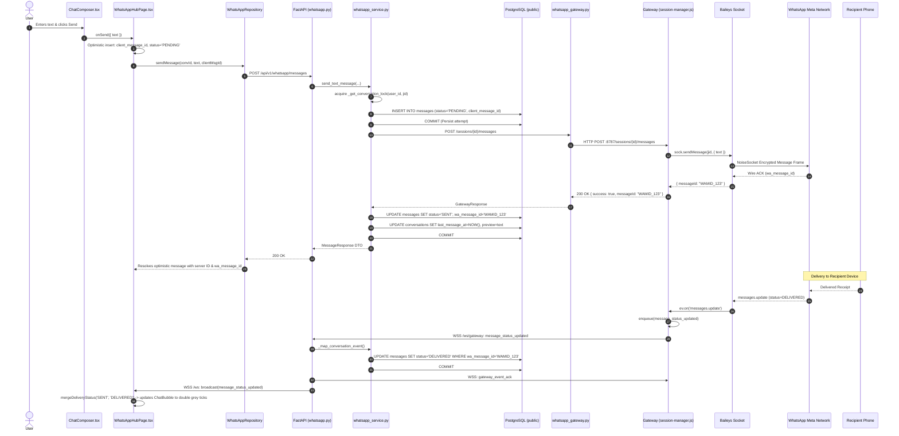
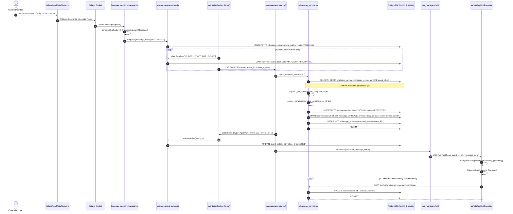

# Phase 11.5 — WhatsApp Message Lifecycle Map

**Document Status**: COMPLETE & VERIFIED  
**Phase**: 11.5 — WhatsApp Architecture Preparation & Characterization  
**Scope**: Complete step-by-step trace of outbound and inbound message lifecycles verified against current implementation.

---

## 1. Outbound Message End-to-End Lifecycle Trace

This trace follows a user typing a message in the Tezlify web app until it is delivered and read by the recipient.

---

## 2. Inbound Message End-to-End Lifecycle Trace

This trace follows an incoming message from a contact arriving at the gateway until it renders in the user's viewport.

---

## 3. Critical Safety Guarantees During Lifecycle Transitions

1. **Identity Unification**:
   - `mergeWhatsAppMessages` in [whatsappMessageMerge.ts](file:///Users/isatezcan/Documents/Github/Tezlify/frontend/src/features/whatsapp/lib/whatsappMessageMerge.ts) unifies message identities across three distinct keys: `id:${message.id}`, `wa:${message.wa_message_id}`, and `client:${message.client_message_id}`.
   - When the optimistic message (`client_message_id`) meets the server confirmation (`id`), they merge into a single entity without flicker.
2. **Delivery Status Monotonicity**:
   - `mergeDeliveryStatus` enforces strict monotonic ranking:
     $$\text{PENDING} \le \text{SENT} \le \text{DELIVERED} \le \text{READ} \equiv \text{RECEIVED}$$
   - An out-of-order `SENT` echo received after a `DELIVERED` receipt will never downgrade the message status.
3. **Multi-Tenant Fail-Closed Isolation**:
   - In `ingest_gateway_event`, if the gateway session ID cannot be mapped to an authenticated user ID, the event is immediately discarded (`EventOwnerUnresolved`), transaction rolled back, and NACK returned to the gateway outbox. Orphaned events are never broadcast to the UI.
