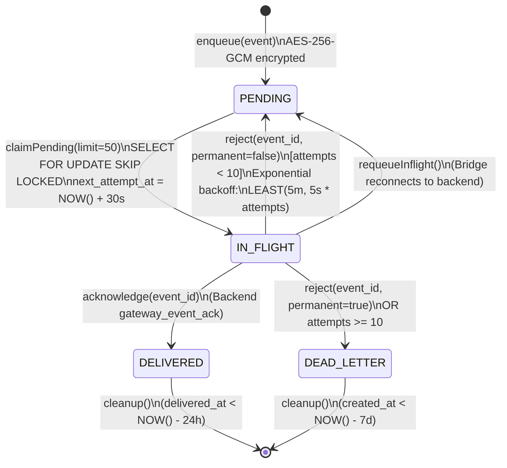

# Phase 11.5 — WhatsApp Outbox State Machine Map

**Document Status**: COMPLETE & VERIFIED  
**Phase**: 11.5 — WhatsApp Architecture Preparation & Characterization  
**Scope**: Verified state transitions, concurrency locking, retry backoff, and cleanup semantics of `whatsapp_private.event_outbox`.

---

## 1. Outbox State Machine Overview

The durable outbox pattern guarantees **at-least-once delivery** from the WhatsApp Gateway to the FastAPI Backend while insulating the system against network partitions, backend restarts, and concurrent worker races.

The state machine is implemented in [postgres-event-outbox.js](file:///Users/isatezcan/Documents/Github/Tezlify/whatsapp-gateway/src/outbox/postgres-event-outbox.js) and operates on the PostgreSQL table `whatsapp_private.event_outbox`.

### 1.1 State Transition Diagram



---

## 2. States & Descriptions

| State | Description | In-Flight Expiry / Lease | Terminal? | Next Transition(s) |
|---|---|---|---|---|
| `PENDING` | Newly enqueued event or retried event awaiting dispatch to backend. | Eligible when `next_attempt_at <= NOW()`. | NO | `IN_FLIGHT` (via `claimPending`) |
| `IN_FLIGHT` | Claimed by outbox pump and actively sent over `/ws/gateway`. | 30-second visibility window (`next_attempt_at = NOW() + 30s`). | NO | `DELIVERED`, `PENDING` (requeue/retry), `DEAD_LETTER` |
| `DELIVERED` | Backend confirmed durable database commit via `gateway_event_ack`. | Marked with `delivered_at = NOW()`. | **YES** | Purged after 24 hours by `cleanup()` |
| `DEAD_LETTER` | Terminal poison-pill state; unrecoverable failure or exceeded max attempts (10). | Stored for post-mortem forensics. | **YES** | Purged after 7 days by `cleanup()` |

---

## 3. Transition Rules & SQL Operations

### 3.1 `enqueue(event)`
- Generates or preserves `event_id` (UUIDv4).
- Encrypts payload with AES-256-GCM using context `tezlify-wa-v1:event:${sessionId}:${eventId}`.
- SQL:
  ```sql
  INSERT INTO whatsapp_private.event_outbox
     (event_id, session_id, event_type, ciphertext, nonce, auth_tag, key_version)
  VALUES ($1, $2, $3, $4, $5, $6, $7)
  ON CONFLICT (event_id) DO NOTHING;
  ```
- Defaults: `state = 'PENDING'`, `attempts = 0`, `next_attempt_at = NOW()`.

### 3.2 `claimPending(limit = 50)`
- Prioritized extraction using `FOR UPDATE SKIP LOCKED`:
  - **Priority 1**: `message_status_updated` (Fast delivery feedback).
  - **Priority 2**: `message_new`, `message_upsert` (Content delivery).
  - **Priority 3**: All other events (`session_*`, `contact_synced`, etc.).
- SQL:
  ```sql
  WITH claimed AS (
     SELECT sequence
     FROM whatsapp_private.event_outbox
     WHERE state IN ('PENDING', 'IN_FLIGHT')
       AND next_attempt_at <= NOW()
     ORDER BY CASE
         WHEN event_type = 'message_status_updated' THEN 1
         WHEN event_type IN ('message_new', 'message_upsert') THEN 2
         ELSE 3
       END ASC, sequence ASC
     FOR UPDATE SKIP LOCKED
     LIMIT $1
  )
  UPDATE whatsapp_private.event_outbox AS outbox
  SET state = 'IN_FLIGHT',
      attempts = outbox.attempts + 1,
      next_attempt_at = NOW() + INTERVAL '30 seconds'
  FROM claimed
  WHERE outbox.sequence = claimed.sequence
  RETURNING outbox.sequence, outbox.event_id, outbox.session_id,
            outbox.event_type, outbox.ciphertext, outbox.nonce,
            outbox.auth_tag, outbox.key_version, outbox.attempts;
  ```

### 3.3 `acknowledge(eventId)`
- Triggered by backend `gateway_event_ack`.
- SQL:
  ```sql
  UPDATE whatsapp_private.event_outbox
  SET state = 'DELIVERED', delivered_at = NOW()
  WHERE event_id = $1 AND state <> 'DELIVERED';
  ```

### 3.4 `reject(eventId, { permanent = false })`
- Triggered by backend `gateway_event_nack` or pump error.
- SQL:
  ```sql
  UPDATE whatsapp_private.event_outbox
  SET state = CASE WHEN $2 OR attempts >= 10 THEN 'DEAD_LETTER' ELSE 'PENDING' END,
      next_attempt_at = NOW() + LEAST(INTERVAL '5 minutes', INTERVAL '5 seconds' * GREATEST(attempts, 1))
  WHERE event_id = $1 AND state <> 'DELIVERED';
  ```

### 3.5 `requeueInflight()`
- Invoked whenever the event bridge establishes or re-establishes a WebSocket connection to the backend.
- Resets orphaned in-flight items without waiting for the 30-second expiry timeout.
- SQL:
  ```sql
  UPDATE whatsapp_private.event_outbox
  SET state = 'PENDING', next_attempt_at = NOW()
  WHERE state = 'IN_FLIGHT';
  ```

### 3.6 `cleanup()`
- Runs on a 10-minute recurring schedule.
- Batched deletion (1,000 rows max per batch) to eliminate database lock churn.
- SQL:
  ```sql
  WITH doomed AS (
     SELECT sequence FROM whatsapp_private.event_outbox
     WHERE (state = 'DELIVERED' AND delivered_at < NOW() - INTERVAL '24 hours')
        OR (state = 'DEAD_LETTER' AND created_at < NOW() - INTERVAL '7 days')
     ORDER BY sequence ASC LIMIT 1000
  )
  DELETE FROM whatsapp_private.event_outbox
  WHERE sequence IN (SELECT sequence FROM doomed);

  DELETE FROM whatsapp_private.processed_events
  WHERE processed_at < NOW() - INTERVAL '7 days';
  ```
