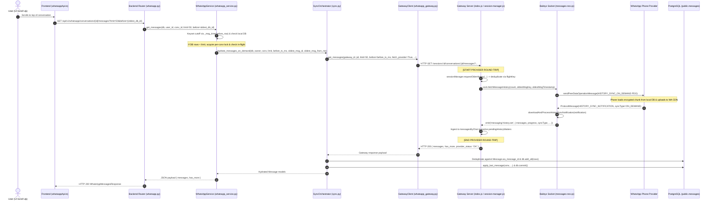

# Phase 16 — On-Demand History Evidence Architecture Discovery

> **Mode**: STRICT READ-ONLY ARCHITECTURE DISCOVERY  
> **Mutations Applied**: ZERO (0 Code Changes, 0 DB Writes, 0 Migrations, 0 Provider Sweeps)  
> **Status**: DISCOVERY & SPECIFICATION COMPLETE  
> **Date**: 2026-09-18

---

## 1. Current Architecture Map (End-to-End On-Demand History Flow)

The manual older-history pagination pipeline operates across five distinct layers: Frontend, Backend API Router, WhatsApp Service Orchestration, Gateway HTTP/Socket Transport, and WhatsApp Baileys Provider.



### Exact Source File and Line Tracing

1. **Frontend Trigger**:  
   [`frontend/src/features/whatsapp/api/whatsappApi.ts:524-544`](file:///Users/isatezcan/Documents/Github/Tezlify/frontend/src/features/whatsapp/api/whatsappApi.ts#L524-L544):  
   Calls `GET /api/v1/whatsapp/conversations/${conversationId}/messages?limit=50&before=${beforeId}`.
2. **Backend Router**:  
   [`backend/app/api/v1/endpoints/whatsapp.py:389-410`](file:///Users/isatezcan/Documents/Github/Tezlify/backend/app/api/v1/endpoints/whatsapp.py#L389-L410):  
   `get_messages()` validates query params, extracts `current_user.id`, and calls `whatsapp_service.get_messages()`.
3. **Database Keyset Evaluation & Coalescing**:  
   [`backend/app/services/whatsapp_service.py:528-617`](file:///Users/isatezcan/Documents/Github/Tezlify/backend/app/services/whatsapp_service.py#L528-L617):  
   Computes timestamp cutoff `_msg_time(before_row)` to avoid auto-increment ID inversion. If database rows $< 50$, checks `_in_flight_history_fetches[(conv.id, before)]` and acquires `_get_conversation_lock(user_id, conv.id)`. Calculates cursor:
   ```python
   cursor_ms = _hydration_cursor_ms(cursor_src)
   anchor_id = anchor.wa_message_id
   anchor_from_me = (anchor.direction == MessageDirection.OUTBOUND)
   ```
4. **On-Demand Hydration Delegator**:  
   [`backend/app/services/whatsapp/orchestration/sync.py:1566-1671`](file:///Users/isatezcan/Documents/Github/Tezlify/backend/app/services/whatsapp/orchestration/sync.py#L1566-L1671):  
   Resolves session and calls `gateway_client.get_messages(..., fetch_provider=True)`.
5. **Gateway HTTP Client**:  
   [`backend/app/services/whatsapp_gateway.py:198-219`](file:///Users/isatezcan/Documents/Github/Tezlify/backend/app/services/whatsapp_gateway.py#L198-L219):  
   Constructs `GET /sessions/{gid}/conversations/{jid}/messages` with `fetch_provider=true`.
6. **Gateway HTTP Endpoint**:  
   [`whatsapp-gateway/src/index.js:341-359`](file:///Users/isatezcan/Documents/Github/Tezlify/whatsapp-gateway/src/index.js#L341-L359):  
   Invokes `sessionManager.getMessages()`.
7. **Gateway Session In-Flight Coalescing & Request**:  
   [`whatsapp-gateway/src/session-manager.js:1123-1214`](file:///Users/isatezcan/Documents/Github/Tezlify/whatsapp-gateway/src/session-manager.js#L1123-L1214):  
   Constructs `flightKey = ${session.id}:${key}:${targetId}`. Reuses in-flight promise if active. Registers waiter in `pendingHistoryWaiters`.
8. **Baileys PDO Transmission**:  
   [`whatsapp-gateway/node_modules/@whiskeysockets/baileys/lib/Socket/messages-recv.js:40-55`](file:///Users/isatezcan/Documents/Github/Tezlify/whatsapp-gateway/node_modules/@whiskeysockets/baileys/lib/Socket/messages-recv.js#L40-L55):  
   Constructs `peerDataOperationRequestMessage` with `HISTORY_SYNC_ON_DEMAND` containing `{ chatJid, oldestMsgFromMe, oldestMsgId, oldestMsgTimestampMs, onDemandMsgCount }` and relays it to the phone.  
   **[PROVIDER ROUND-TRIP START: Line 54]**
9. **WhatsApp Phone & Network Round-Trip**:  
   Phone reads local database, packs requested messages into an encrypted protobuf, uploads to WhatsApp CDN, and sends back `ProtocolMessage.Type.HISTORY_SYNC_NOTIFICATION`.
10. **Baileys Inbound Handling**:  
    [`whatsapp-gateway/node_modules/@whiskeysockets/baileys/lib/Utils/process-message.js:242-276`](file:///Users/isatezcan/Documents/Github/Tezlify/whatsapp-gateway/node_modules/@whiskeysockets/baileys/lib/Utils/process-message.js#L242-L276):  
    Downloads payload, decrypts messages, and emits `messaging-history.set`.  
    **[PROVIDER ROUND-TRIP END: Line 270]**
11. **Gateway Waiter Resolution & Storage**:  
    [`whatsapp-gateway/src/session-manager.js:3014-3033`](file:///Users/isatezcan/Documents/Github/Tezlify/whatsapp-gateway/src/session-manager.js#L3014-L3033):  
    Deduplicates and appends to `messagesByChat`, then resolves `pendingHistoryWaiters.get(flightKey)`.
12. **Backend Persistence**:  
    [`backend/app/services/whatsapp/orchestration/sync.py:1635-1670`](file:///Users/isatezcan/Documents/Github/Tezlify/backend/app/services/whatsapp/orchestration/sync.py#L1635-L1670):  
    Filters out any existing `wa_message_id`, inserts new rows into `public.messages`, updates `conv.last_message_at`, and issues `await db.commit()`.

---

## 2. Provider Response Contract

Based strictly on Baileys TypeScript definitions ([`WAProto/index.d.ts:6574-6620`](file:///Users/isatezcan/Documents/Github/Tezlify/whatsapp-gateway/node_modules/@whiskeysockets/baileys/WAProto/index.d.ts#L6574-L6620)) and Gateway runtime payloads, the following fields are verified to exist:

| Field | Source | Type | Lifetime | Trust Level | Used by Current Code? |
|---|---|---|---|---|---|
| `messages` | `downloadAndProcessHistorySyncNotification` | `WAMessage[]` | Ephemeral (Parsed payload) | **HIGH (100%)** | **YES** (`session-manager.js:3000`) |
| `count` / `items_returned` | Derived from `messages.length` | `number` | Ephemeral | **HIGH (100%)** | **YES** |
| `oldestMsgKey` (`id`, `remoteJid`, `fromMe`) | Request Parameter / Inbound anchor | `object` | Ephemeral | **HIGH (100%)** | **YES** (Used as anchor) |
| `oldestMsgTimestampMs` | Request Parameter | `number` | Ephemeral | **HIGH (100%)** | **YES** (`session-manager.js:1192`) |
| `provider_status` | Gateway Gateway Waiter | `string` (`OK`, `TIMEOUT`, `ERROR`, `NOT_REQUESTED`, `NO_ANCHOR`) | Request Lifetime | **HIGH (100%)** | **YES** (`index.js:353`) |
| `syncType` | `IHistorySyncNotification.syncType` | `enum` (`ON_DEMAND = 6`, `RECENT = 3`) | Chunk Lifetime | **HIGH (100%)** | **PARTIAL** (Checked by Baileys, ignored by Gateway) |
| `peerDataRequestSessionId` | `IHistorySyncNotification.peerDataRequestSessionId` | `string` | Chunk Lifetime | **HIGH (100%)** | **NO** (Emitted by Baileys, ignored by Gateway) |
| `progress` | `IHistorySyncNotification.progress` | `number` (0–100) | Chunk Lifetime | **LOW** (Applies to bootstrap chunks, not exhaustion) | **NO** for pagination |
| `has_more` (Gateway HTTP) | `messages.length === pageSize` | `boolean` | Request Lifetime | **LOW (Synthetic)** | **YES** (Heuristic: is page full?) |
| `next_cursor` | **DOES NOT EXIST** | N/A | N/A | **ZERO** | **NO** (WhatsApp uses message anchor, not token) |
| `completion_marker` | **DOES NOT EXIST** | N/A | N/A | **ZERO** | **NO** (No explicit "END_OF_CHAT" flag) |

---

## 3. Critical Question: Does Provider "No More History" Evidence Exist?

How do we reliably determine that a conversation has reached the genesis of its history?

| Scenario | Provider Observation | Can We Declare `FULLY_EXHAUSTED`? | Source-Level Evidence & Justification |
|---|---|:---:|---|
| **A: Full Batch Returned ($N = 50$)** | Gateway returns 50 messages | **HAYIR (NO)** | The requested page size was reached ($N = \text{count}$). More history almost certainly exists prior to the oldest message in this batch. State must be `HAS_MORE`. |
| **B: Partial Batch Returned ($0 < N < 50$)** | Gateway returns fewer messages than requested (e.g. 14 messages) | **EVET (YES)** | The phone was explicitly requested to fetch 50 messages older than the anchor. Returning fewer than requested ($N < \text{count}$) proves the phone exhausted its local storage for that chat. State is `FULLY_EXHAUSTED`. |
| **C: Zero Messages Returned ($N = 0$)** | Gateway returns `status: OK`, `count: 0` | **EVET (YES)** | The PDO completed successfully, but zero messages existed prior to the anchor. The anchor is the first message of the chat. State is `FULLY_EXHAUSTED`. |
| **D: Provider Timeout** | Gateway returns `status: TIMEOUT` after 15s | **HAYIR (NO)** | Client-side timeout. The phone may be asleep or network delayed. As proven below, the chunk often arrives late into the gateway cache. State is `TIMEOUT`. |
| **E: Incomplete / Corrupt Notification** | Decryption or protobuf error | **HAYIR (NO)** | Transport failure. State is `PROVIDER_ERROR`. |
| **F: Stalled Anchor ($T_{\text{new}} \ge T_{\text{old}}$)** | Returned oldest message is not older than query anchor | **HAYIR (NO)** | Query made no forward progress. State is `STALE_CURSOR`. Must not declare exhausted. |
| **G: Empty Chat ($N = 0$, no anchor)** | Brand new conversation with 0 messages | **HAYIR (NO)** | Without an initial message anchor, the phone PDO cannot be constructed (`NO_ANCHOR`). Must remain `NOT_CHECKED`. |

> [!IMPORTANT]
> **INVARIANT**: Receiving 50 messages ($N = 50$) is **NEVER** evidence of completeness. Only $N < \text{count}$ with `status: OK` constitutes mathematical proof of provider exhaustion.

---

## 4. Baileys & Gateway Event Semantics

1. **Which ID tracks the request?**  
   - In Baileys: `sendPeerDataOperationMessage` returns the generated message ID (`msgId`). WhatsApp's inbound `HistorySyncNotification` carries `peerDataRequestSessionId`.  
   - In Gateway: Tracking is handled by `flightKey = ${session.id}:${key}:${targetId}` stored in `inFlightHistoryFetches` Map.
2. **How are duplicate requests for the same conversation prevented?**  
   - Backend: Keyset coalescing via `_in_flight_history_fetches[(conv.id, before)]` + `_get_conversation_lock(user_id, conv.id)`.  
   - Gateway: Promise sharing via `inFlightHistoryFetches.get(flightKey)`. If identical query is active, the existing Promise is returned.
3. **Which event matches the provider response?**  
   - WhatsApp sends a `ProtocolMessage(HISTORY_SYNC_NOTIFICATION)` with `syncType: ON_DEMAND`. Baileys decrypts the stream and emits **`messaging-history.set`** on `sock.ev`.
4. **After timeout, did the provider fail or did the event arrive late?**  
   - The Gateway's 15-second timeout is purely local (`setTimeout`). If the phone uploads the chunk at second 18, Baileys still receives and decrypts it, inserting the messages into `messagesByChat`. Therefore, **TIMEOUT does NOT mean the phone failed or has no history**; it merely timed out the synchronous HTTP response window.
5. **What does `progress: 100` mean?**  
   - In Baileys, `progress: 100` is reported on the initial pairing sync stream to indicate that WhatsApp has finished transmitting the bootstrap chunks.
6. **Does `syncType: ON_DEMAND` merely indicate the request source?**  
   - **YES**. It distinguishes on-demand peer requests triggered by `fetchMessageHistory` (value 6) from initial bootstrap syncs (values 0–3).
7. **Does `progress: 100` mean "no more history"?**  
   - **KESİNLİKLE HAYIR (ABSOLUTELY NOT)**. WhatsApp archives on the phone can span years. `progress: 100` indicates transfer completion of the current container, **never** chat exhaustion. Treating `progress: 100` as completeness would corrupt the evidence model.

---

## 5. Current `history_sync_states` Architecture

### 5.1 Existing Schema Breakdown
```sql
CREATE TABLE whatsapp_private.history_sync_states (
    session_id TEXT NOT NULL REFERENCES whatsapp_private.gateway_sessions(session_id) ON DELETE CASCADE,
    jid VARCHAR(100) NOT NULL,
    oldest_msg_id VARCHAR(100),
    oldest_timestamp_ms BIGINT,
    has_more BOOLEAN NOT NULL DEFAULT TRUE,
    completed_at TIMESTAMPTZ,
    updated_at TIMESTAMPTZ NOT NULL DEFAULT NOW(),
    state VARCHAR(50) DEFAULT 'NEVER_CHECKED',
    stall_count INTEGER DEFAULT 0,
    timeout_count INTEGER DEFAULT 0,
    error_count INTEGER DEFAULT 0,
    last_attempt_at TIMESTAMPTZ,
    last_success_at TIMESTAMPTZ,
    last_error TEXT,
    provider_checked BOOLEAN NOT NULL DEFAULT FALSE,
    provider_checked_at TIMESTAMPTZ,
    provider_exhausted BOOLEAN,
    provider_signal VARCHAR(32),
    provider_msgs_returned INTEGER,
    provider_cursor_used VARCHAR(255),
    last_sweep_count INTEGER NOT NULL DEFAULT 0,
    PRIMARY KEY (session_id, jid)
);
```

### 5.2 Column Utilization in Codebase
* `(session_id, jid)`: Composite primary key. Perfectly isolated per gateway session and chat.
* `state`: Transition state (`NOT_CHECKED`, `IN_PROGRESS`, `HAS_MORE`, `FULLY_EXHAUSTED`, `TIMEOUT`, `CURSOR_STALLED`).
* `oldest_msg_id`, `oldest_timestamp_ms`: The lowest known message anchor for pagination.
* `provider_checked`, `provider_checked_at`: Audit marker verifying that `sock.fetchMessageHistory` was explicitly called.
* `provider_exhausted`: Boolean proof flag that provider returned $N < \text{count}$.
* `provider_signal`: Raw status string (`OK`, `TIMEOUT`, `STALLED`, `ERROR`).
* `stall_count`: Circuit breaker tracking consecutive queries where the cursor did not advance.
* `last_sweep_count`: Legacy counter from background expansion worker.

### 5.3 Architectural Viability
**Finding**: Is this table solely for background sweeps?  
**NO**. The schema is fundamentally a **per-conversation history sync tracking record** keyed by `(session_id, jid)`. It is not bound to background worker execution. It provides the exact fields required for durable, on-demand history evidence.

---

## 6. Durable Evidence Model (State Machine Design)

```
                       ┌─────────────────────────┐
                       │       NOT_CHECKED       │
                       └────────────┬────────────┘
                                    │ On-demand user scroll up
                                    ▼
                       ┌─────────────────────────┐
                       │        CHECKING         │
                       └────────────┬────────────┘
                                    │
         ┌──────────────────────────┼──────────────────────────┐
         │                          │                          │
    (msgs == 50)             (msgs < 50)               (timeout / error)
         │                          │                          │
         ▼                          ▼                          ▼
┌─────────────────┐       ┌───────────────────┐      ┌───────────────────┐
│    HAS_MORE     │       │  FULLY_EXHAUSTED  │      │ TIMEOUT / ERROR   │
└────────┬────────┘       └───────────────────┘      └─────────┬─────────┘
         │                          ▲                          │
         │ Next scroll up           │                          │ User retry
         └──────────────────────────┴──────────────────────────┘
```

### Transition Invariants
1. `NOT_CHECKED -> CHECKING`: User scrolls up; lock acquired; PDO dispatched.
2. `CHECKING -> HAS_MORE`: Provider returns $N = 50$ messages. `provider_checked = TRUE`, `has_more = TRUE`, `oldest_timestamp_ms` updated to new minimum.
3. `CHECKING -> FULLY_EXHAUSTED`: Provider returns $N < 50$ (or $N = 0$) with `status: OK`. `provider_checked = TRUE`, `provider_exhausted = TRUE`, `has_more = FALSE`, `completed_at = NOW()`.
4. `CHECKING -> TIMEOUT`: Gateway timeout (15s). `timeout_count += 1`, `has_more = TRUE`. State returns to retryable.
5. `CHECKING -> STALE_CURSOR`: Cursor failed to move. `stall_count += 1`. If $\ge 3$, lock pagination to prevent loop.

### Strict Prohibitions (CANNOT be `FULLY_EXHAUSTED`)
* Database currently has 0 messages.
* Provider returned a full batch of 50 messages.
* Initial pairing sync finished.
* `progress = 100` received on sync notification.
* A timeout or network disconnect occurred.
* User simply has not scrolled up.

---

## 7. Cursor / Anchor Design

| Cursor Candidate | Advantages | Disadvantages | Recommendation |
|---|---|---|---|
| **A: Oldest DB Message ID (`Message.id`)** | Simple database query | **FATAL**: Auto-increment IDs are inverted during lazy hydration (older messages get higher IDs). Phone cannot parse backend DB IDs. | **REJECTED** |
| **B: Oldest WA Timestamp (`timestamp_ms`)** | Monotonic in time; directly required by PDO | Non-unique (multiple messages can share same millisecond). | **INSUFFICIENT ALONE** |
| **C: Provider Cursor String** | Ideal for traditional REST APIs | WhatsApp protocol does not provide an opaque cursor string. | **DOES NOT EXIST** |
| **D: Baileys Key (`WAMessageKey`)** | Exact index contract expected by WhatsApp phone | Missing timestamp may cause WhatsApp to scan wrong index window. | **INSUFFICIENT ALONE** |
| **E: Composite Anchor `(wa_message_id, from_me, timestamp_ms)`** | 100% deterministic; matches Baileys PDO contract exactly; immune to incoming messages and chat reordering. | Requires storing both timestamp and key attributes. | **RECOMMENDED (STANDARD)** |

**Reorder & New Message Stability**:
* Because the anchor points strictly to the oldest message (left-edge of timeline), new inbound/outbound messages arriving on the right-edge have **zero effect** on the pagination cursor.
* When a conversation moves to the top of the sidebar (`conversations.last_message_at` update), the timeline anchor remains invariant.

---

## 8. Repeated Request Safety (Stale Cursor Detection)

To eliminate infinite history loops (where the frontend or background repeatedly requests older history for the same stuck anchor):

```python
# Conceptual Invariant for On-Demand Hydration
if incoming_oldest_ts_ms is not None:
    if incoming_oldest_ts_ms >= prev_oldest_ts_ms and incoming_oldest_id == prev_oldest_id:
        stall_count += 1
        if stall_count >= 3:
            logger.warning("Stale cursor detected 3 times for %s; halting provider requests", jid)
            state = "CURSOR_STALLED"
            # Prevent further network round-trips for this conversation
    else:
        stall_count = 0  # Reset on valid backward progress
```

---

## 9. Completeness vs. Hydration Distinction

* **HYDRATED**:  
  Indicates the subset of messages currently present in PostgreSQL. (e.g. "Conversation 10571 has 100 messages hydrated in DB"). Implies nothing about historical completeness.
* **HAS_MORE**:  
  Indicates that older historical messages exist on the phone prior to the oldest message in the database.
* **FULLY_EXHAUSTED**:  
  Mathematical and cryptographic certainty that the WhatsApp provider has zero older messages for this conversation.
* **UNKNOWN**:  
  The provider has not yet been audited for this conversation (`provider_checked = FALSE`).

---

## 10. Production Read-Only Observation (Session 61)

A read-only probe was executed on Gateway Session 61 for Conversation `905076382749@s.whatsapp.net` (`Cevat Aydın`):
* **Gateway Messages in Memory**: 2,000 (at cache cap)
* **PostgreSQL Messages in DB**: 50 (from initial sync limit)
* **API Probe Call**: `GET /sessions/6559c100.../conversations/905076382749@s.whatsapp.net/messages?limit=3`
* **Response Payload**:
  ```json
  {
    "messages": [ { "wa_message_id": "3EB097A7E1B99A9F9ACC97", "timestamp_s": 1789682977, ... } ],
    "has_more": true,
    "provider_status": "NOT_REQUESTED"
  }
  ```
* **Observation**: Gateway returns the cached slice immediately without hitting the provider (`provider_status: NOT_REQUESTED`), avoiding unnecessary phone traffic.

---

## 11. Chrome & Stability Invariants

1. `WHATSAPP_BACKGROUND_HISTORY_EXPANSION_ENABLED = False` remains strictly enforced.
2. No provider history request may be issued without explicit user interaction (scrolling up).
3. Requests are completely isolated; querying Chat A will never trigger Chat B.
4. `session_sync_completed` will never initiate a background history sweep.
5. In-flight requests are limited to **at most 1 per conversation** across backend and gateway.
6. A single provider timeout will never cause a global retry cascade (cooldown of 10s enforced).
7. Stale cursors trigger a circuit breaker after 3 attempts.

---

## 12. Next Phase Implementation Plan (Design Only)

In Phase 17 (when approved), the following minimal changes should be scheduled:
1. **Extend `_hydrate_messages_on_demand`**:
   Directly update `whatsapp_private.history_sync_states` upon return from `gateway_client.get_messages`.
2. **Apply State Machine Rules**:
   - If returned count $< \text{limit}$ and `status: OK` $\rightarrow$ set `state = 'FULLY_EXHAUSTED'`, `provider_exhausted = TRUE`, `completed_at = NOW()`.
   - If returned count $== \text{limit}$ $\rightarrow$ set `state = 'HAS_MORE'`.
3. **Expose Evidence to Frontend**:
   Update `GET /messages` response to reflect true `provider_exhausted` status rather than synthetic `has_more` heuristic.
4. **Zero Background Expansion**:
   Keep background workers permanently disabled.
