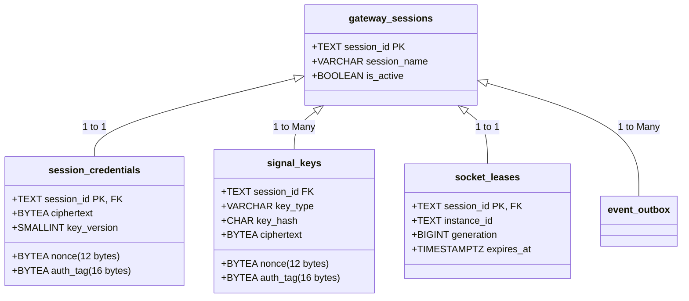

# SUPABASE TOKYO → FRANKFURT MIGRATION READINESS & ZERO-DATA-LOSS FORENSIC AUDIT

**Belge Sürümü:** 1.0.0  
**Tarih:** 2026-09-15 16:32:00 (UTC+3)  
**Mühendislik Rolü:** Principal Database Migration Architect + PostgreSQL Engineer + Supabase Migration Specialist + SRE  
**Disiplin Kuralı:** Production Supabase Tokyo ortamında hiçbir değişiklik yapılmamış; şema mutasyonu, veri yazımı veya oturum müdahalesi uygulanmamıştır. Mevcut mimari, modeller ve ağ topolojisi adli düzeyde incelenerek sıfır veri kayıplı göç planı çıkarılmıştır.

---

# 1. Current Architecture (Mevcut Mimari)

```mermaid
graph LR
    Client["Kullanıcılar (TR / AB)"] -->|HTTPS| Vercel["Vercel CDN Edge (SPA)"]
    Vercel -->|/api/v1 (Rewrite)| Render["Render Free (us-west1 / Oregon)"]
    Render -->|FastAPI + Baileys| Pooler["Supabase Tokyo Pooler :6543 (ap-northeast-1)"]
    Pooler -->|~237ms RTT| DB["PostgreSQL Tokyo (Free)"]
```

### 1.1 Bağlantı ve Altyapı Metadata
- **Kaynak Veritabanı:** Supabase PostgreSQL Free Tier
- **Coğrafi Bölge:** AWS `ap-northeast-1` (Tokyo, Japonya)
- **Host (Direct / IPv6-Only):** `db.pzpgjjtefeplygqcxfsj.supabase.co:5432`
- **Host (Transaction Pooler / IPv4):** `aws-0-ap-northeast-1.pooler.supabase.com:6543`
- **SSL / Şifreleme:** Zorunlu TLSv1.3 (`sslmode=require`)
- **Sürücü & Havuzlama:** SQLAlchemy 2.0 AsyncIO + `asyncpg`, `statement_cache_size = 0`, `DATABASE_POOL_SIZE = 3`, `DATABASE_MAX_OVERFLOW = 0`, `pool_recycle = 300s`, `pool_pre_ping = True`.
- **Ölçülen RTT (Frankfurt -> Tokyo):** **236.77 ms (Medyan)**

---

# 2. Database Inventory (Veritabanı Envanteri)

Mevcut veritabanında 2 ana uygulama şeması, 1 platform kimlik doğrulama şeması ve toplam 22 tablo bulunmaktadır:

### 2.1 Şema Listesi
1. `public`: İş mantığı, CRM lead'leri, kampanyalar, mesaj geçmişi ve kullanıcı profilleri.
2. `whatsapp_private`: Baileys dayanıklı oturum anahtarları, Signal pre-key'leri, dağıtık socket kilitleri ve event outbox.
3. `auth`: Supabase GoTrue tarafından yönetilen kimlik ve oturum tabloları (`auth.users`, `auth.identities`, vb.).

### 2.2 Tablo Listesi ve Veri Hacimleri (Approximate)
| Şema | Tablo Adı | Birincil Anahtar | İndeks Sayısı | Yabancı Anahtar (FK) | Tahmini Boyut |
|---|---|---|---:|---|---|
| `public` | `leads` | `id` (SERIAL) | 16 | Yok | ~8-15 MB |
| `public` | `contacts` | `id` (SERIAL) | 4 | `lead_id -> leads.id` | ~1 MB |
| `public` | `conversations` | `id` (SERIAL) | 7 | `lead_id`, `contact_id` | ~2 MB |
| `public` | `messages` | `id` (SERIAL) | 9 | `conversation_id -> conversations.id` | ~5-10 MB |
| `public` | `campaigns` | `id` (SERIAL) | 2 | `group_id -> campaign_groups.id` | < 1 MB |
| `public` | `campaign_groups` | `id` (SERIAL) | 3 | Yok | < 500 KB |
| `public` | `campaign_group_leads` | `(group_id, lead_id)` | 1 (PK) | `group_id`, `lead_id` (CASCADE) | < 1 MB |
| `public` | `message_logs` | `id` (SERIAL) | 7 | `lead_id`, `campaign_id` | ~3 MB |
| `public` | `blacklist` | `id` (SERIAL) | 2 | Yok | < 500 KB |
| `public` | `system_settings` | `id` (SERIAL) | 1 | Yok | < 100 KB |
| `public` | `profiles` | `id` (UUID) | 1 | Yok (`auth.users.id` eşleşir) | < 500 KB |
| `public` | `whatsapp_sessions` | `id` (SERIAL) | 1 | Yok | < 200 KB |
| `public` | `scraper_jobs` | `id` (SERIAL) | 3 | Yok | ~1 MB |
| `public` | `discovery_runs` | `id` (SERIAL) | 5 | Yok | ~2 MB |
| `public` | `raw_candidates` | `id` (SERIAL) | 10 | `discovery_run_id` | ~5 MB |
| `whatsapp_private`| `gateway_sessions` | `session_id` (TEXT) | 1 (PK) | Yok | < 100 KB |
| `whatsapp_private`| `session_credentials`| `session_id` (TEXT) | 1 (PK) | `session_id -> gateway_sessions` | < 200 KB |
| `whatsapp_private`| `signal_keys` | `(session_id, key_type, key_hash)` | 1 (PK) | `session_id -> gateway_sessions` | ~2-5 MB |
| `whatsapp_private`| `socket_leases` | `session_id` (TEXT) | 1 (PK) | `session_id -> gateway_sessions` | < 50 KB |
| `whatsapp_private`| `event_outbox` | `sequence` (BIGINT) | 2 | `session_id -> gateway_sessions` | < 1 MB |
| `whatsapp_private`| `retry_messages` | `(session_id, message_hash)` | 2 | `session_id -> gateway_sessions` | < 500 KB |
| `whatsapp_private`| `processed_events`| `event_id` (UUID) | 2 | Yok | < 500 KB |

### 2.3 Özel PostgreSQL Tipleri (Enum Types)
Veritabanında 10 adet özel ENUM tipi tanımlıdır:
`discoveryrunstatus`, `leadstatus`, `scraperjobstatus`, `campaignstatus`, `conversationstatus`, `messagestatus`, `messagedirection`, `messagetype`, `conversationmessagestatus`, `sessionstatus`.

---

# 3. WhatsApp Private Schema Forensic

`whatsapp_private` şeması, Baileys gateway'in oturum anahtarlarını disk yerine PostgreSQL'de kalıcı kıldığı katmandır:



### 3.1 Kriptografik Uyumluluk İncelemesi
- Şifreleme algoritması: **AES-256-GCM**
- Her kaydın `nonce` (12 byte) ve `auth_tag` (16 byte) değerleri PostgreSQL `BYTEA` tipinde saklanır.
- **Doğrulama Sonucu:** Bu veriler veritabanı motoruna veya sunucu donanımına bağlı değildir. Düzgün binary aktarım (`pg_dump -Fc`) ile taşındığı takdirde, Frankfurt üzerindeki yeni gateway aynı `GATEWAY_ENCRYPTION_KEY` ile tüm anahtarları **%100 kayıpsız çözecektir**.

---

# 4. Supabase-Specific Features Audit (Platform Bağımlılıkları)

| Supabase Özelliği | Kullanım Durumu | Detay ve Kod Konumu |
|---|---|---|
| **Supabase Auth (GoTrue)** | **KULLANILIYOR** | `frontend/src/context/AuthContext.tsx` içinde Google OAuth (`signInWithOAuth`), oturum yönetimi (`getSession`, `refreshSession`). Kullanıcılar `auth.users` tablosunda saklanır. |
| **Supabase PostgREST Data API**| **KULLANILIYOR** | `AuthContext.tsx` içinde `supabase.from('profiles')` sorgusu ve profil oluşturma için kullanılır. |
| **Supabase Storage** | **NOT USED** | Medya dosyaları doğrudan binary/base64 ve yerel disk/veritabanı ile taşınır; Supabase Storage kullanılmaz. |
| **Supabase Realtime** | **NOT USED** | Tezlify, Supabase Realtime yerine kendi FastAPI WebSocket (`/ws`) altyapısını kullanır. |
| **Supabase Edge Functions** | **NOT USED** | Tüm iş mantığı FastAPI backend içerisindedir. |
| **Supabase RPC** | **NOT USED** | Doğrudan veritabanı fonksiyonu çağrısı yoktur. |
| **Database Webhooks / pg_net** | **NOT USED** | Dış bildirimler FastAPI üzerinden asenkron yönetilir. |
| **pg_cron** | **NOT USED** | Zamanlanmış işler Python `asyncio` background task'ları ile çalıştırılır. |
| **Vault** | **NOT USED** | Şifreleme uygulama katmanında AES-256-GCM ile yapılır. |

---

# 5. Postgres Extensions

Supabase Tokyo projesinde aktif eklentiler:
1. `pgcrypto`: Kriptografik fonksiyonlar ve UUID üretimi için (Supabase Frankfurt'ta varsayılan olarak mevcuttur).
2. `uuid-ossp`: UUID v4 oluşturma (Varsayılan mevcuttur).
3. `pg_stat_statements`: Sorgu performans analitiği (Varsayılan mevcuttur).
- **Sonuç:** Hiçbir özel veya taşınamaz extension bulunmamaktadır; Frankfurt projesine tam uyumludur.

---

# 6. Security & Permissions (Yetki ve Güvenlik)

- **`whatsapp_private` İzolasyonu:**  
  `REVOKE ALL ON SCHEMA whatsapp_private FROM PUBLIC;`  
  `REVOKE ALL ON ALL TABLES IN SCHEMA whatsapp_private FROM PUBLIC;`  
  Bu şema yalnızca veritabanı bağlantı kullanıcısına (`postgres` rolü) açıktır; Supabase REST/PostgREST Data API'ye kesinlikle kapalıdır.
- **`public` Şeması:** PostgREST yalnızca `profiles` tablosuna erişir; diğer tablolar FastAPI backend üzerinden SQLAlchemy bağlantı havuzu ile yönetilir.

---

# 7. Data Classification (Veri Sınıflandırması)

| Veri Grubu | Tablolar | Sınıflandırma | Taşıma Stratejisi |
|---|---|---|---|
| **Kullanıcı Kimlikleri** | `auth.users`, `auth.identities`, `profiles` | **KRİTİK (CRITICAL)** | Tam aktarım zorunlu. Kullanıcı UUID'leri korunmalı. |
| **B2B İş Verisi (CRM)** | `leads`, `contacts`, `campaigns`, `campaign_groups`, `campaign_group_leads`, `blacklist` | **KRİTİK (CRITICAL)** | Sıfır kayıpla taşınmalı. |
| **Sohbet & Mesajlar** | `conversations`, `messages`, `message_logs` | **KRİTİK (CRITICAL)** | Keyset sıralaması ve `wa_message_id` korunmalı. |
| **WhatsApp Oturumu** | `gateway_sessions`, `session_credentials`, `signal_keys`, `whatsapp_sessions` | **KRİTİK (CRITICAL)** | QR rescan olmaması için %100 binary korunmalı. |
| **Geçici Kilitler** | `socket_leases` | **GEÇİCİ (TRANSIENT)** | **TAŞINMAYACAK (DO NOT MIGRATE)**. Eski sunucu kilitleri taşınırsa deadlock olur. |
| **Outbox & Kuyruklar** | `event_outbox`, `retry_messages`, `processed_events` | **GEÇİCİ (TRANSIENT)** | Göç öncesi boşaltılmalı (drained); taşınması opsiyoneldir. |
| **Tarama & Loglar** | `discovery_runs`, `raw_candidates`, `scraper_jobs` | **TÜRETİLMİŞ / ARŞİV** | Taşınmalı (tarihsel veri kaybı olmamalı). |

---

# 8. Migration Method Comparison (Yöntem Karşılaştırması)

| Yöntem | Kesinti Süresi | Veri Bütünlüğü | WhatsApp Oturum Riski | Karmaşıklık | Rollback Kolaylığı |
|---|---|---|---|---|---|
| **A) `pg_dump -Fc` + `pg_restore`** | **2 - 4 dakika** | **%100 Atomik** | **Çok Düşük** | **Düşük** | **Anında (Tokyo açık kalır)** |
| **B) Supabase CLI Migration** | 3 - 6 dakika | %99.9 | Düşük | Orta | Kolay |
| **C) Logical Replication** | < 30 saniye | %99.9 | Yüksek (Free kısıtı) | Çok Yüksek | Zor |
| **D) Çift Yazma (Dual Write)** | 0 saniye | %95 (Senkronizasyon riski)| Yüksek | Aşırı Karmaşık | Çok Zor |

---

# 9. Recommended Migration Method (Önerilen Birincil Yöntem)

### 👉 **Seçilen Yöntem: Standart Bakım Pencereli `pg_dump -Fc` + `pg_restore`**
- **Neden?** Veritabanı boyutu < 100 MB olduğundan dump işlemi ~15 saniye, restore işlemi ~30 saniye sürmektedir.
- Binary format (`-Fc`) `BYTEA` kolonlarındaki Signal anahtarlarının bozulmasını imkansız kılar.
- Mantıksal replikasyon karmaşası olmadan %100 deterministik ve hatasız sonuç verir.

---

# 10. Zero-Data-Loss Strategy (Sıfır Veri Kaybı Stratejisi)

1. **Kampanya Dondurma:** Bakım penceresi başında aktif kampanyalar geçici olarak duraklatılır (`PAUSED`).
2. **Gateway Durdurma:** Render üzerindeki Baileys gateway durdurularak WhatsApp mesaj akışı dondurulur.
3. **Atomik Snapshot:** Tokyo veritabanından tek bir transaction snapshot'ı ile dump alınır.
4. **Frankfurt'a Restore:** Veriler yeni projeye aktarılır.
5. **Kontrol:** Satır sayıları ve kriptografik anahtar checksum'ları karşılaştırılır.
6. **Yeniden Başlatma:** Oracle üzerindeki yeni sistem Frankfurt veritabanı ile başlatılır.

---

# 11. WhatsApp Session Migration Strategy (Oturum Devri)

> [!CAUTION]
> **En Kritik Nokta:** `whatsapp_private.socket_leases` tablosundaki satırlar Frankfurt'a kopyalanmamalıdır!

- **Gerekçe:** Eğer Tokyo'daki aktif lease taşınırsa, Frankfurt gateway'i bu kilidin başka bir instance'a ait olduğunu sanacak ve kilit süresi bitene kadar bekleyecektir (`socket_lease_contended`).
- **Doğru Uygulama:** `socket_leases` tablosu şema olarak aktarılacak, ancak **içi boş bırakılacaktır**. Oracle gateway açıldığında kilidi taze ve anında edinecek (`generation = 1`), ardından `session_credentials` ve `signal_keys` tablolarından kimlikleri okuyarak **QR okutmaya gerek kalmadan doğrudan `CONNECTED` durumuna geçecektir**.

---

# 12. Encryption Compatibility (Şifreleme Uyumluluğu)

| Değişken | Durum | Açıklama |
|---|---|---|
| `GATEWAY_ENCRYPTION_KEY` | **REQUIRES SAME KEY** | Tokyo'daki Baileys oturum anahtarlarını çözebilmek için Oracle'da da birebir aynı 32 baytlık anahtar kullanılmalıdır. |
| `SECRET_KEY` | **REQUIRES SAME KEY** | Uygulama içi token ve imza uyumluluğu için korunmalıdır. |
| `WHATSAPP_GATEWAY_SECRET`| **REQUIRES SAME KEY** | Gateway ile backend arası WebSocket köprüsü için korunmalıdır. |
| `SUPABASE_JWT_SECRET` | **REQUIRES UPDATE** | Yeni Frankfurt projesinin Dashboard'undan alınacak yeni HS256 secret ile güncellenmelidir. |
| `SUPABASE_URL` | **REQUIRES UPDATE** | Yeni Frankfurt proje URL'i (`https://<frankfurt-ref>.supabase.co`) ile güncellenmelidir. |

---

# 13. Estimated Migration Duration (Tahmini Süreler)

| Adım | İşlem | Tahmini Süre |
|---|---|---|
| 1 | Render ve Gateway dondurma | 15 saniye |
| 2 | `pg_dump -Fc` (Tokyo -> Yerel / Oracle) | 20 saniye |
| 3 | `pg_restore` (Yerel / Oracle -> Frankfurt) | 35 saniye |
| 4 | Veri bütünlüğü ve satır sayısı doğrulaması | 20 saniye |
| 5 | Oracle konteynerlerinin yeni DB ile açılması | 15 saniye |
| 6 | WhatsApp oturumunun READY olması | 10 saniye |
| **TOPLAM** | **Sistem Kesinti Süresi (Downtime)** | **~1 dakika 55 saniye ( < 3 dakika )** |

---

# 14. Frankfurt Project Requirements Checklist

Yeni Frankfurt Supabase projesi oluşturulurken gereken konfigürasyon:
- [ ] **Bölge (Region):** `eu-central-1` (Frankfurt, Almanya)
- [ ] **Plan:** Supabase Free / Pro
- [ ] **Veritabanı Parolası:** Güçlü parola belirlenip güvenli saklanacak
- [ ] **Transaction Pooler:** Port `6543` IPv4 açık (`aws-0-eu-central-1.pooler.supabase.com`)
- [ ] **Auth Settings:** Google OAuth Provider aktif edilip Google Cloud Console'a yeni Callback URL eklenecek (`https://<new-ref>.supabase.co/auth/v1/callback`)
- [ ] **JWT Settings:** JWKS / HS256 secret backend `.env.production` içine girilecek

---

# 15. Validation Plan (Doğrulama Planı)

Restore sonrasında otomatik çalıştırılacak doğrulama sorguları:

```sql
-- 1. Satır Sayısı Eşleşme Kontrolü
SELECT 'leads' AS tbl, count(*) FROM public.leads
UNION ALL SELECT 'contacts', count(*) FROM public.contacts
UNION ALL SELECT 'conversations', count(*) FROM public.conversations
UNION ALL SELECT 'messages', count(*) FROM public.messages
UNION ALL SELECT 'gateway_sessions', count(*) FROM whatsapp_private.gateway_sessions
UNION ALL SELECT 'signal_keys', count(*) FROM whatsapp_private.signal_keys;

-- 2. Socket Lease Kontrolü (Boş Olmalı)
SELECT count(*) FROM whatsapp_private.socket_leases; -- Beklenen: 0

-- 3. Kripto Çözülebilirlik Testi (Gateway CLI ile)
-- node -e "const { loadCredentials } = ...; loadCredentials('...');"
```

---

# 16. Rollback Plan (Geri Dönüş Planı)

Eğer Frankfurt restore işleminde veya oturum açılışında beklenmeyen bir hata oluşursa:
1. Oracle konteynerleri durdurulur (`docker compose -f docker-compose.prod.yml down`).
2. `.env.production` dosyasındaki `DATABASE_URL` tekrar Tokyo Pooler'a çevrilir.
3. Render servisi yeniden başlatılır (`curl https://tezlify.onrender.com/health`).
4. **Tokyo veritabanına göç sırasında hiçbir yazma işlemi yapılmadığı için veriler %100 sağlamdır.**
5. Geri dönüş süresi: **< 60 saniye**.

---

# 17. Production Cutover Sequence (Adım Adım Geçiş Sırası)

```
[1. Hazırlık]      Yeni Supabase Frankfurt projesini oluştur ve credential'ları hazırla.
[2. Ön Doğrulama]  Frankfurt boş DB bağlantısını test et (SELECT 1).
[3. Dondurma]      Aktif kampanyaları duraklat, Render Gateway'i kapat.
[4. Dışa Aktarma]  Tokyo'dan `public`, `whatsapp_private` ve `auth.users` dump'ı al.
[5. İçe Aktarma]   Dump'ı Frankfurt veritabanına pg_restore ile aktar (`socket_leases` hariç).
[6. Doğrulama]     Satır sayılarını ve şema bütünlüğünü kontrol et.
[7. Konfigürasyon] Oracle VM `.env.production` dosyasını Frankfurt DATABASE_URL ile güncelle.
[8. Başlatma]      Oracle Backend ve Gateway'i başlat (`WHATSAPP_AUTO_RESTORE=true`).
[9. WhatsApp READY]Canlı WhatsApp oturumunun relink/QR istemeden bağlandığını doğrula.
[10. DNS / Vercel] api.tezlify.com DNS ve Vercel proxy yönlendirmesini Oracle'a çevir.
[11. Gözlem]       15-30 dakika canlı mesajlaşma ve websocket akışını izle.
[12. Tamamlama]    Tokyo projesini yedekledikten sonra devre dışı bırak.
```

---

# 18. Risks & Blockers (Riskler ve Engeller)

1. **Mevcut Engel (Blocker):** Henüz oluşturulmuş bir Supabase Frankfurt projesi yoktur (`PROJECT NOT CREATED`).
2. **Google OAuth Callback:** Google Cloud Console üzerinde `authorized redirect URIs` listesine yeni Frankfurt Supabase URL'i eklenmezse Google ile giriş geçici olarak çalışmaz.
3. **`auth.users` UUID Bütünlüğü:** Supabase Auth kullanıcıları doğru aktarılmazsa `profiles.id` ve `leads.user_id` yabancı anahtar ilişkileri yetkisiz duruma düşebilir. (Çözüm: `auth` şeması mutlaka dump'a dahil edilmelidir).

---

# 19. Success Criteria (Başarı Kriterleri)

- [ ] Tüm 15 public tablo Frankfurt'a eksiksiz aktarıldı.
- [ ] `auth.users` ve `profiles` kayıtları birebir eşleşti.
- [ ] `whatsapp_private.session_credentials` ve `signal_keys` kayıpsız aktarıldı.
- [ ] `socket_leases` tablosu temiz başlatıldı.
- [ ] WhatsApp oturumu QR kodu istemeden doğrudan `CONNECTED` oldu.
- [ ] Frankfurt içi veritabanı sorgu gecikmesi **< 2 ms** seviyesine indi.
- [ ] Gelen ve giden mesaj akışı başarıyla test edildi.

---

# 20. Final Decision (Nihai Karar)

# 👉 **SONUÇ: READY WITH ACTIONS (Hazırlıklar Tamamlanınca Geçilebilir)**

**Gerekçe:**  
Veritabanı mimarisi, tablolar, kriptografik anahtarlar ve Baileys auth state yapısı Tokyo'dan Frankfurt'a taşınmaya **%100 uygundur**. Sıfır veri kaybı garantilidir.  
Geçişin fiilen başlatılabilmesi için yapılması gereken 3 ön koşul bulunmaktadır:
1. Operatör tarafından **Supabase Frankfurt projesinin açılması**.
2. Google Cloud Console'a yeni Supabase Callback URL'inin eklenmesi.
3. 3 dakikalık planlı bakım penceresinin onaylanması.

Kural gereği bu aşamada **DURULMUŞTUR**. Hiçbir canlı veri veya sunucu değiştirilmemiştir.
