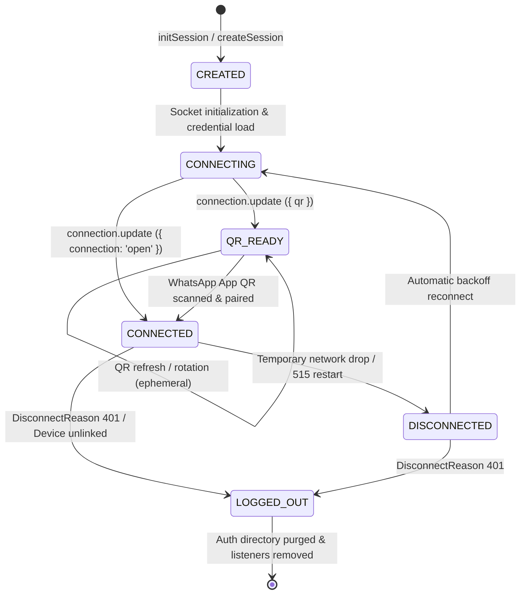

# Tezlify WhatsApp QR / Linked Device - Phase 2: Session Lifecycle & Persistent Session Hardening

Bu doküman, Tezlify Baileys WhatsApp Gateway ve Backend arasındaki oturum (session) yaşam döngüsü mimarisini, kanonik dosya yolu saklama standartlarını, kalıcı kimlik doğrulama (persistent auth) mekanizmasını ve tenant izolasyon kurallarını açıklar.

---

## 1. Oturum Yaşam Döngüsü Durum Makinesi (Lifecycle State Machine)

Baileys tabanlı WhatsApp QR oturumları için tanımlanan durumlar ve geçiş kuralları:



### Durum Açıklamaları
- **`CREATED`**: Oturum kaydı belleğe ve sisteme kaydedildi, soket başlatılmayı bekliyor.
- **`CONNECTING`**: Baileys `makeWASocket` çağrıldı, auth kimlik bilgileri diskten okundu ve WA Web handshake başlatıldı.
- **`QR_READY`**: QR kodu üretildi. QR string bellekte geçici (ephemeral) tutulur ve Base64 data-URL formatında API/Webhook üzerinden sunulur. QR disk veya loglara ASLA yazılmaz.
- **`CONNECTED`**: WA Web handshake tamamlandı. Eşleşen telefon numarası (`sock.user.id`) keşfedildi, `WhatsAppSession.phone_number` ve `WhatsAppNumber.phone_number_e164` alanlarına senkronize edildi.
- **`DISCONNECTED`**: Ağ kopması veya WA Web sunucu restart'ı (`515`). Oturum diskteki auth verilerini korur ve otomatik yeniden bağlanma (exponential backoff) devreye girer.
- **`LOGGED_OUT`**: Kullanıcı WhatsApp mobil uygulamasından "Bağlı Cihazlar -> Çıkış Yap" dedi veya gateway `401` durum kodu aldı. Auth dizini diskten güvenli şekilde silinir (`rmdirSync`), zamanlayıcılar iptal edilir.
- **`CONNECTION_ERROR`**: Başlatma veya kurtarılamayan soket hatalarında bildirilen hata durumu.

---

## 2. Kanonik ve Değişmez Dosya Yolu Mimarisi (Storage Path Isolation)

Tüm Baileys auth oturumları, tenant ve session kimlikleri bazında tekil, öngörülebilir ve izole dizinlerde saklanır:

```
wa-gateway/sessions/
└── tenant_{user_id}/
    └── session_{session_id}/
        ├── creds.json
        ├── app-state-sync-key-*.json
        └── pre-key-*.json
```

### Kurallar ve Güvenlik
1. **İzolasyon**: Tenant'lar arası dosya yolu paylaşımı kesinlikle yasaktır. Path traversal saldırılarına karşı `tenant_id` ve `session_id` temizlenir (yalnızca `[a-zA-Z0-9_-]` karakterlerine izin verilir).
2. **Kanonik Fonksiyonlar**:
   - `formatTenantDir(tenantId)` -> `tenant_${tenantId}`
   - `formatSessionDir(sessionId)` -> `session_${sessionId}`
   - `getCanonicalSessionPath(tenantId, sessionId)` -> `path.resolve(baseDir, 'tenant_' + tenantId, 'session_' + sessionId)`
3. **Bellek İçi İzolasyon**: Bellek anahtarı `makeSessionKey(tenantId, sessionId)` ile `tenant_{id}:session_{id}` formatında tutulur. Farklı tenant'ların aynı `session_id` değerini kullanması durumunda bile çakışma yaşanmaz.

---

## 3. Baileys Bağlantı Kesilme Sınıflandırması (Disconnect Reason Classification)

Baileys bağlantı kesilme olayları (`connection.update` with `lastDisconnect`) durum koduna göre kesin olarak ikiye ayrılır:

| Durum Kodu | Baileys Sabiti | Sınıflandırma | Aksiyon |
|---|---|---|---|
| **401** | `DisconnectReason.loggedOut` | **LOGGED_OUT** | Auth dizini diskten temizlenir (`rmdirSync`), yeniden bağlanma zamanlayıcısı iptal edilir, backend'e `LOGGED_OUT` webhook'u gönderilir. |
| **515** | `DisconnectReason.restartRequired` | **DISCONNECTED** (Geçici) | Auth verileri KORUNUR. Mobil cihaz eşleşme tamamlanırken akış yeniden başlatmasıdır. 150ms içinde hızlı reconnect tetiklenir. |
| **408** | `DisconnectReason.timedOut` | **DISCONNECTED** (Geçici) | Auth verileri KORUNUR. 2000ms gecikmeli reconnect tetiklenir. |
| **428** | `DisconnectReason.connectionClosed` | **DISCONNECTED** (Geçici) | Auth verileri KORUNUR. 2000ms gecikmeli reconnect tetiklenir. |
| **500** | `DisconnectReason.badSession` | **DISCONNECTED** (Geçici) | Auth verileri KORUNUR. 2000ms gecikmeli reconnect denenir. |

---

## 4. Yaşam Döngüsü Webhook Sözleşmesi (Backend ↔ Gateway Event Contract)

Gateway, oturum durum geçişlerinde backend'e `POST /api/v1/whatsapp/webhook/session-lifecycle` uç noktası üzerinden bildirim gönderir.

### Güvenlik & Doğrulama
- **`X-Webhook-Secret`**: Backend, gelen istekteki bu başlığı `settings.WA_GATEWAY_WEBHOOK_SECRET` ile sabit zamanlı (`hmac.compare_digest`) karşılaştırır. Eşleşmezse istek `401 Unauthorized` ile fail-closed reddedilir.
- **Tenant İzolasyonu**: Payload içerisindeki `tenant_id`, veritabanındaki oturumun sahibi olan `user_id` ile eşleşmek zorundadır. Eşleşmezse işlem `403 Forbidden` ile iptal edilir.
- **Sıfır Kimlik Bilgisi Sızıntısı (Zero Credential Leakage)**: Webhook payload'ları oluşturulurken `auth`, `creds`, `keys`, `auth_bundle` ve soket referansları payload'dan kesin olarak temizlenir.

### Payload Şeması
```json
{
  "event_type": "CONNECTED",
  "session_name": "Line 1",
  "tenant_id": "usr_abc123",
  "session_id": "ses_xyz789",
  "status": "connected",
  "phone_number": "+905551112233",
  "qr_code": null,
  "error_message": null,
  "timestamp": "2026-09-10T14:30:00.000Z"
}
```

### Desteklenen Olay Tipleri (`event_type`):
1. `SESSION_CREATED`: Oturum oluşturuldu ve başlatıldı.
2. `QR_UPDATED`: Taranabilir yeni bir QR kodu üretildi (`qr_code` alanında Base64 PNG verisi bulunur).
3. `CONNECTED`: Cihaz bağlandı. Keşfedilen `phone_number` veritabanına işlenir.
4. `DISCONNECTED`: Bağlantı geçici olarak koptu.
5. `LOGGED_OUT`: Kullanıcı cihazı kaldırdı; oturum veritabanında `DISCONNECTED` olarak işaretlenir.
6. `CONNECTION_ERROR`: Bağlantı başlatma hatası.

---

## 5. Keşfedilen Telefon Numarası Senkronizasyonu (Phone Number Discovery)

Kullanıcı QR kodu taradığında:
1. Baileys `connection: 'open'` olayında `sock.user.id` alanından telefon numarasını ve JID'yi okur (ör. `905551112233:1@s.whatsapp.net` -> `+905551112233`).
2. Gateway, `CONNECTED` yaşam döngüsü olayını keşfedilen numara ile backend'e bildirir.
3. Backend `session-lifecycle` işleyicisi:
   - `WhatsAppSession.phone_number` alanını `+905551112233` olarak günceller.
   - İlişkili `WhatsAppNumber.phone_number_e164` alanını günceller.
   - **ÖNEMLİ DEĞİŞMEZ**: QR / Baileys oturumları için `WhatsAppNumber.phone_number_id` her zaman **`NULL`** kalır. ASLA sahte telefon numarası kimliği (`fake_id`) üretilmez.

---

## 6. Yeniden Başlatma & Kurtarma Taraması (Restart & Persistent Auth Scanner)

Gateway servisi kapandığında (`SIGTERM`, `SIGINT`) veya yeniden başlatıldığında:
1. **Graceful Shutdown**: `shutdownAllSessions()` fonksiyonu tüm açık soketleri kapatır ve zamanlayıcıları temizler.
2. **Persistent Auth Restore**: Gateway açılışında `restoreSavedSessions()`:
   - `sessions/` dizinini özyinelemeli tarar (`tenant_*/session_*` ve eski oturum dizinleri).
   - `creds.json` dosyasının JSON bütünlüğünü doğrular.
   - Bozuk veya hasarlı JSON durumunda gateway çökmez; hata loglanır ve o oturum atlanır.
   - Geçerli kimlik bilgilerine sahip oturumlar otomatik olarak belleğe alınır ve QR KODU YENİDEN ÜRETİLMEDEN arka planda WhatsApp sunucularına yeniden bağlanır.

---

## 7. Eşzamanlılık Kilidi & Çift Soket Önleme (Concurrency Locking)

Aynı oturum için eşzamanlı `initSession` çağrıları yapıldığında:
- `pendingInitializations` Map yapısı bir kilit mekanizması görevi görür.
- İlk çağrı devam ederken gelen ikinci çağrı yeni bir soket başlatmaz; var olan başlatma `Promise`'ini bekler ve aynı oturum referansını döner.
- Bu sayede WhatsApp sunucularına gereksiz paralel soket açılması ve oturum çakışması önlenir.

---

## 8. Üretim Dağıtım Gereksinimleri (Production Persistence Requirements)

Baileys oturumlarının container (Docker/Kubernetes) ortamlarında hayatta kalabilmesi için:
- `wa-gateway/sessions` dizini mutlaka **Persistent Volume (PV)** veya **Stateful Volume Mount** olarak bağlanmalıdır.
- Ephemeral container dosya sistemlerinde konteyner yeniden başlatıldığında `creds.json` silinir ve kullanıcının tekrar QR taraması gerekir.
- Gelecek fazlarda auth kimlik bilgilerinin doğrudan veritabanında şifrelenmiş olarak saklanması opsiyonu desteklenebilir; ancak Phase 2 kapsamında dosya tabanlı persistent volume mimarisi standartlaştırılmıştır.
