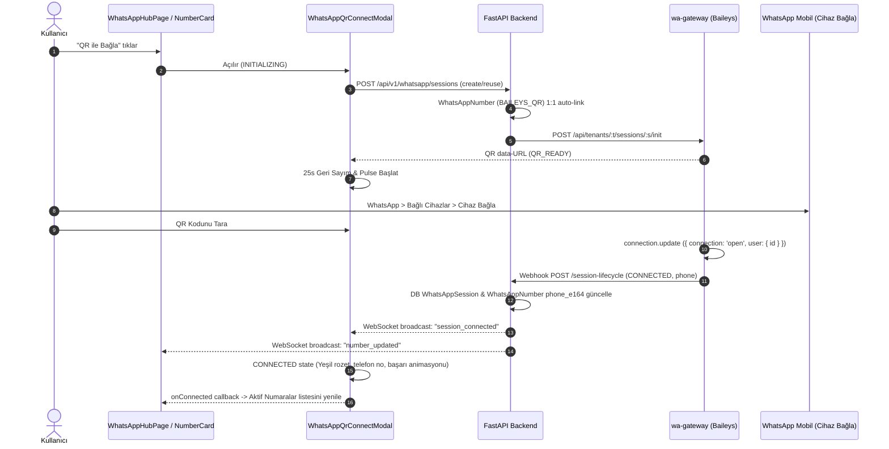

# Tezlify WhatsApp QR / Linked Device - Phase 3: Frontend QR Connection Flow

Bu doküman, Tezlify WhatsApp QR / Linked Device entegrasyonunun 3. Fazı olan **Frontend QR Connection Flow** mimarisini, Vuexy tasarım sistemine entegre modal ve kart bileşenlerini, gerçek zamanlı WebSocket durum makinesini ve güvenlik ilkelerini belgeler.

---

## 1. Mimari Genel Bakış ve UX Akışı

Kullanıcı arayüzü WhatsApp Hub sayfasında (`frontend/src/pages/WhatsAppHubPage.tsx`) "Aktif Numaralar" sekmesinden QR ile bağlantı akışını başlatır:

---

## 2. QR Modal Durum Makinesi (State Machine)

`WhatsAppQrConnectModal.tsx` bileşeni 7 net durumlu bir durum makinesi uygular:

| Durum | Açıklama | UI Öğeleri & Davranış |
|---|---|---|
| `INITIALIZING` | Oturum oluşturuluyor ve QR kodu hazırlanıyor | Vuexy Spinner, "QR Kodu Hazırlanıyor..." |
| `QR_READY` | Canlı QR kodu hazır | QR görseli, 3 adımlı WhatsApp talimatı, 25s canlı geri sayım çubuğu, "QR Kodunu Yenile" butonu |
| `CONNECTING` | Cihaz tarandı, el sıkışması ve anahtar senkronizasyonu sürüyor | Dönen halka ikonu, "WhatsApp'a Bağlanıyor...", lütfen bekleyin uyarısı |
| `CONNECTED` | Cihaz başarıyla eşleşti (`open`) | Yeşil onay ikonu, keşfedilen uluslararası telefon numarası (`+90...`), "Bağlantı Başarılı!", 3s otomatik kapanış sayacı |
| `DISCONNECTED` | Geçici ağ kopması veya soket düşüşü | Sarı uyarı ikonu, "Bağlantı geçici olarak kesildi, yeniden bağlanılıyor..." |
| `LOGGED_OUT` | Mobil uygulamadan cihaz bağlantısı kaldırıldı (`401`) | Kırmızı hata ikonu, oturumun sonlandığı bildirimi, "Tekrar Bağla" butonu |
| `ERROR` | Beklenmeyen ağ veya gateway hatası | Kırmızı hata ikonu, kullanıcı dostu hata mesajı (güvenli, no stack trace), "Tekrar Dene" butonu |

---

## 3. QR Süre Aşımı ve Kimlik Koruma (Preserving Session Identity)

1. **25 Saniyelik Güvenli Zamanlayıcı**:
   - Her yeni QR geldiğinde 25 saniyelik geri sayım başlar.
   - Zamanlayıcı bittiğinde QR görseli üzerine yarı saydam `qrExpired` katmanı biner ve "QR Kodunu Yenile" butonu vurgulanır.
2. **Kimlik Değişmezliği (Session Identity Preservation)**:
   - "QR Kodunu Yenile" tıklandığında `POST /api/v1/whatsapp/sessions/:id/refresh-qr` çağrılır.
   - Yeni bir `session_id`, yeni bir `WhatsAppNumber` veya yeni bir disk dizini **oluşturulmaz**.
   - Mevcut oturum ve kimlik bilgileri üzerinde Baileys soketine taze QR üretimi yaptırılır.

---

## 4. Aktif Numaralar Entegrasyonu: BAILEYS_QR vs META_CLOUD

`WhatsAppNumberCard.tsx` her iki sağlayıcı tipini kusursuz ve birbirini etkilemeyecek şekilde ayrıştırır:

| Özellik | `META_CLOUD` | `BAILEYS_QR` |
|---|---|---|
| **Rozet (Badge)** | Mavi `Meta Cloud API` | Zümrüt Yeşil `QR / Baileys` + `Çoklu Cihaz (Linked Device)` |
| **Telefon Numarası ID** | `ID: 1234567890` gösterilir | Gösterilmez (`NULL` invariant) |
| **WABA / Meta Alanları** | WABA ID, Quality Rating gösterilir | Gizlenir |
| **Doğrulama (Verify)** | Meta API Token testi | Baileys Gateway canlı soket kontrolü |
| **Bağlantı Kesik İse Aksiyon** | Yeniden Yetkilendir | "QR Kodu Tara" butonu açılır ve doğrudan modalı tetikler |

---

## 5. Güvenlik ve Veri Bütünlüğü İlkeleri

1. **Sıfır Kalıcı QR Depolama**:
   - QR raw string'i frontend'de yalnızca modalın yerel React belleğinde (`useState`) tutulur.
   - `localStorage`, `sessionStorage` veya tarayıcı cookie'lerine **ASLA** yazılmaz.
   - Tarayıcı konsoluna QR verisi loglanmaz.
2. **Kimlik Bilgisi Sızıntısı Engeli**:
   - Gateway ve Backend webhook yanıtları hiçbir private key, AES secret veya `creds.json` içeriği içermez.
3. **Tenant İzolasyonu**:
   - Frontend doğrudan kullanıcının doğrulanmış oturum kimliği (`current_user.id`) üzerinden işlem yapar; URL veya body parametreleriyle başka tenant'ın oturumuna erişilemez.

---

## 6. Doğrulama ve Test Sonuçları

- **Frontend Build**: `tsc && vite build` -> **Exit code 0, Başarılı**
- **Gateway Unit & Multi-Device Tests**:
  - `sessionManager.test.js` -> **PASS**
  - `phase2_session_lifecycle.test.js` -> **17/17 PASS**
  - `phase3_frontend_qr_flow.test.js` -> **12/12 PASS**
- **Backend Entegrasyon Testleri**:
  - `backend/tests/test_whatsapp_phase3_qr_frontend_flow.py` -> **6/6 PASS**
  - Backend genel test paketi: `659 passed, 5 skipped, 0 failed in 37.85s`
